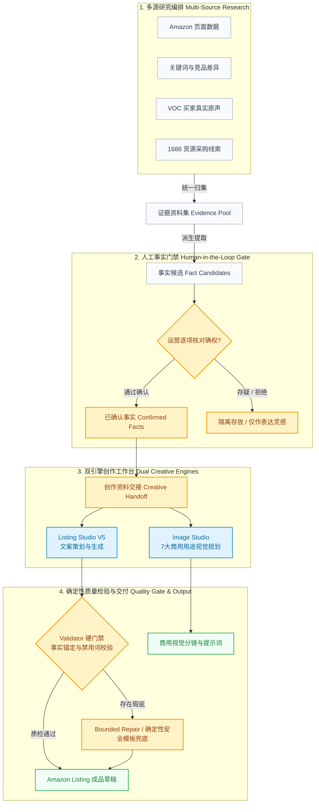

<div align="center">

# 轻选工作台 (QingXuan Workbench)

**面向跨境电商（Amazon）的证据驱动型商品研究与 Listing / 视觉素材创作工作台**  
*Evidence-Driven AI Workbench for Amazon Product Research, Listing & Visual Asset Creation*

<p align="center">
  <a href="https://nextjs.org"></a>
  <a href="https://react.dev"></a>
  <a href="https://www.typescriptlang.org"></a>
  <a href="https://tailwindcss.com"></a>
  <a href="https://www.prisma.io"></a>
  <a href="https://vitest.dev"></a>
  <a href="LICENSE"></a>
</p>

<p align="center">
  <a href="#-为什么需要轻选工作台">核心价值</a> •
  <a href="#-系统主链与工作流">系统架构</a> •
  <a href="#-核心能力矩阵">核心功能</a> •
  <a href="#-快速上手">快速启动</a> •
  <a href="#-技术栈与工程防线">技术架构</a> •
  <a href="#-完整文档导航">文档体系</a>
</p>

<p align="center">
  
</p>

</div>

---

## 💡 为什么需要轻选工作台？

在 Amazon 运营与上架流程中，团队常常面临两难拉扯：

* **文案要打动买家**：需要深刻洞察痛点、场景化表达与吸引点击的卖点提炼；
* **事实必须严格可查**：尺寸、材质、认证、配件与承重数据绝不能凭空捏造，否则将直接面临退货纠纷、差评甚至平台下架处罚。

通用大模型（如 ChatGPT / Claude 简单对话）在撰写电商文案时极易产生**无依据幻觉**（编造认证、夸大耐用度或虚构参数）。**轻选工作台**从底层重塑了人机协作分工：**AI 负责表达，代码负责检验，人类负责确权**。

### 对比：传统大模型对话 vs 轻选工作台受控证据链

| 评估维度 | 传统通用 AI 提示词生成 | 轻选工作台 (QingXuan Workbench) |
| :--- | :--- | :--- |
| **事实准确性** | ❌ 容易幻觉虚构参数、虚假承诺（如盲目声称“终身防水”、“军工级耐用”） | ✅ **强事实绑定**：仅允许使用经过人工逐项确认的客观事实（Confirmed Facts） |
| **可解释与溯源** | ❌ 黑盒输出，无法知晓每个卖点源自哪条评论或规格数据 | ✅ **端到端可追溯**：每句话带证据引用快照与版本指纹（`contextFingerprint`） |
| **质量安全门禁** | ❌ 生成即结束，好坏对错全靠人工肉眼逐字纠偏排查 | ✅ **确定性双重质检**：自动化 Validator 硬门禁拦截违规词、未锚定声明，支持安全回退 |
| **合规与风控防护** | ❌ 容易误用违禁词、侵权竞品商标或夸大功效 | ✅ **安全词库与边界策略**：内置 Amazon 敏感词与语义边界过滤，杜绝违规踩坑 |
| **业务流连续性** | ❌ 散碎对话，无法沉淀商品研究成果，数据无法复用 | ✅ **完整研发闭环**：多源研究 → 事实确权 → 创作交接 → 文案生成 → 视觉规划 |
| **数据与隐私安全** | ❌ 商业研究数据直接暴露于公网云端对话框 | ✅ **Local-First**：本地 SQLite 存储，敏感密钥仅留本地，支持完全离线 Mock 演练 |

---

## 🔄 系统主链与工作流

轻选工作台严格贯彻 **`Evidence ≠ Fact`（证据不等于事实）** 的工程铁律。外部采集的 Amazon 页面、关键词词根、VOC 买家评论与 1688 供应链线索先沉淀为**参考证据集**；唯有经过运营人员逐条确权，方能转化为商品事实，进而驱动 Listing 与图像创作。



> [!IMPORTANT]
> **核心铁律：Evidence ≠ Fact**  
> 外部采集的页面资料、竞品文案、VOC 评论或供应链信息均仅为参考材料（Evidence）。未经运营人员逐项确认，任何内容绝不允许晋升为目标商品的硬事实（Confirmed Facts），从根源杜绝 AI 凭空捏造。

---

## ✨ 核心能力矩阵

### 1. 🔍 多源商品研究编排 (Research Orchestrator)
* **多源结构化数据聚合**：一站式归集 Amazon 页面核心参数、核心搜索词与长尾词库、竞品差异化卖点以及 VOC（Voice of Customer）真实买家评论痛点。
* **供应链货源辅助**：支持联动 1688 货源线索与采购参考。
* **故障隔离机制**：外部 Sourcing 或辅助工具连接异常时，系统诚实展示失败并提供重试入口，绝不伪造成功假象，且绝不阻塞 Listing 主链推进。

### 2. 🛡️ 事实门禁与确权 (Human-in-the-Loop Fact Gate)
* **逐项审核确权**：每项候选事实支持独立人工确认、编辑修订或拒绝隔离。
* **修订版本追溯 (CAS Revision)**：每一次事实变更生成独立版本快照，状态持久化至本地数据库，刷新无缝恢复。
* **资料交接把关 (Creative Handoff Gate)**：未完成事实核验的任务严禁触发正式文案生成，防止脏数据污染。

### 3. ✍️ Listing Studio V5 (确定性表达工程)
* **全套标准文案输出**：高辨识度标题（Title）、5 维核心五点描述（Bullet Points）、长篇商品描述（Description）以及后台精准搜索词（Backend Search Terms）。
* **唯一真理源 `approvedBenefits`**：生成过程与质检阶段统一遵循单源事实授权矩阵，杜绝非授权的语义过度外推（如尺寸规格不得随意推论为“完美适配所有背包”）。
* **Validator 硬门禁自动质检**：
  * 逐句校验事实锚点（Fact Anchoring）；
  * 实时过滤虚假宣传、绝对化用语与违禁词；
  * 校验失败时自动触发有限度自愈修复（Bounded Repair），极端情况下无缝降级为确定性安全兜底模板。

### 4. 🎨 Image Studio (视觉资产生成辅助)
* **7 大电商标准视觉用途**：白底棚拍图 (`white_studio`)、尺寸规格图 (`dimension_specs`)、使用步骤图 (`usage_steps`)、生活场景图 (`lifestyle`)、细节特写图 (`macro_detail`)、包装套装图 (`packaging_set`)、卖点解析图 (`feature_board`)。
* **8 种高级商用摄影光影风格**：从杂志质感、自然家庭采光到户外商业叙事，满足全方位视觉调性需求。
* **30 秒极简决策流**：首屏清晰聚焦“事实依据 → 推荐槽位 → 视觉用途 → 方案摘要 → 创作意图 → 一键生成”，技术调试参数默认折叠收口。
* **参考图硬门禁 (Reference Gate)**：在缺少已批准实拍参考图时实施安全拦截，防止 AI 凭空篡改商品的形状、结构或物理特征。

---

## 🛠️ 技术栈与工程防线

### 技术架构全景

| 架构层级 | 技术选型 | 说明 |
| :--- | :--- | :--- |
| **前端框架** | Next.js 16.3 (App Router) + React 19 | 现代化服务端组件流式渲染与极速客户端交互 |
| **界面样式** | Tailwind CSS 3.4 + Lucide Icons | 响应式设计（完美适配 1440×900 桌面端与 390×844 移动端） |
| **服务端与编排** | Next.js Route Handlers + TypeScript 5 | 纯 TypeScript 严谨类型系统，全链路运行时合同校验 |
| **数据持久化** | Prisma ORM + SQLite | 本地轻量、零配置安装、支持多任务持久化与快照 |
| **版本并发控制** | CAS (Compare-And-Swap) Revision 控制 | 防多标签页冲突覆盖，保障长流程状态一致性 |
| **质量保证** | Vitest (260+ 单元/契约测试) + Playwright | 严苛的自动化测试套件覆盖事实门禁、Prompt 生成与浏览器全旅程 |

### 三大工程守卫原则

1. **Local-First & 数据隐私**：核心数据持久化于本地 SQLite，不私自上传业务数据；支持离线 Mock 模式，无需配置真实付费 API 即可体验完整闭环。
2. **Fail-Closed 安全防线**：所有外部采集、AI 生成与校验逻辑均实行“失败即断开”策略，任何异常均明确提示，绝不静默伪造“绿灯”。
3. **诚实与免责约束**：系统定位为运营人员的“专业辅助提效工具”，生成的所有内容均为待人工复核草稿，绝不宣称不切实际的“一键爆款”或“转化率翻倍”。

---

## 🚀 快速上手

### 环境要求

* **Node.js**：`>= 20.9.0` (推荐 LTS 版本)
* **npm**：`>= 10.0.0`
* **操作系统**：macOS / Linux / Windows 10/11 (PowerShell 或 WSL2 均可)

### 1. 克隆仓库并安装依赖

```bash
git clone https://github.com/a2578348864a-sys/ecommerce-product-ai-optimizer.git
cd ecommerce-product-ai-optimizer
npm ci
```

### 2. 初始化本地数据库

```bash
npx prisma generate
npx prisma db push
```

> [!NOTE]
> `prisma db push` 仅用于快速构建本地 SQLite 数据库文件，零复杂配置。

### 3. 配置环境变量

```bash
cp .env.example .env.local
```

开箱即用的默认配置采用 `mock` 模式，无需配置任何第三方付费 API Key 即可跑通完整业务流。  
若需接入真实大模型进行生成，可在 `.env.local` 中填入对应凭据：

```ini
# 运行模式：local_owner（本地开发）或 public_showcase（受限演示）
QX_RUNTIME_MODE=local_owner

# AI 模式配置：mock（离线模拟）或 real（真实 Provider）
LISTING_PROVIDER_MODE=mock
IMAGE_PROVIDER_MODE=mock

# 真实 Provider 密钥（仅 real 模式需要）
DEEPSEEK_API_KEY=
OPENAI_API_KEY=
```

### 4. 启动本地工作台

推荐使用内置了环境与端口守护的专属命令启动：

```bash
# 检查本地端口占用与 SQLite 就绪情况
npm run check:local

# 开发模式启动 (热更新)
npm run dev:local

# 或 生产构建并启动生产环境预览 (推荐)
npm run build
npm run start:local
```

启动完成后，在浏览器访问终端打印的本地服务地址（如 `http://127.0.0.1:3005` 或 `http://localhost:3000`）。

---

## 🧪 代码检查与自动化测试

项目拥有严苛的自动化测试体系，任何代码变更均需满足 100% 绿灯：

```bash
# 运行全部测试套件 (Vitest 260+ 测试)
npm test

# 执行 TypeScript 严格类型检查 (0 错误基准)
npx tsc --noEmit --pretty false

# 执行 ESLint 代码规范扫描
npm run lint

# 执行生产打包验证
npm run build
```

针对单个核心模块进行精准单测验证：

```bash
# 运行 Listing V5 事实与质检测试
npx vitest run lib/listingV5

# 运行 Image Studio 视觉门禁测试
npx vitest run components/image-handoff/ lib/imageHandoff/
```

---

## 📚 完整文档导航

| 分类 | 核心文档 | 说明 |
| :--- | :--- | :--- |
| **架构设计** | [系统架构总览 (Architecture)](docs/architecture/overview.md) | 系统分层设计、微内核数据流与组件职责边界 |
| | [证据链与事实隔离 (Evidence Chain)](docs/architecture/evidence-chain.md) | Evidence、Fact Candidates 与 Confirmed Facts 隔离原则 |
| | [安全与并发控制 (Security)](docs/architecture/security.md) | Fail-Closed 策略、CAS 版本控制与安全围栏规范 |
| | [工程决策记录 (ADR)](docs/decisions/engineering-decisions.md) | 关键架构权衡与技术决策历史 |
| **业务与产品** | [产品全景与业务场景](docs/product/product-overview.md) | 核心业务流拆解与跨端体验指南 |
| | [Listing V5 核心说明](docs/listing-v5/FINAL_CLOSE_V9.md) | Writer v9、Blueprint v2 与 Validator v6 落地标准 |
| | [核心操作流程手册](docs/guides/workflow.md) | 从选品导入到 Listing 导出的标准操作指南 (SOP) |
| **部署与开发** | [本地开发指南 (Development)](docs/development/local-development.md) | 本地开发规范、脚本工具集与调试技巧 |
| | [环境变量完全指南 (Config)](docs/guides/configuration.md) | 所有配置项详解与脱敏规范 |
| | [生产部署手册 (Deploy)](docs/deployment/production-runbook.md) | 生产服务部署、PM2/进程守护与本地自启动配置 |
| | [历史版本与归档记录](docs/archive/README.md) | 历史实验版本（V3 / V4 / 阶段性验收证据）归档追溯 |

---

## ⚖️ 合规声明与边界约束

1. **非自动发布系统**：轻选工作台生成的文案与视觉方案均为**待人工复核的准备草稿**，不代表最终在 Amazon 上架的发布承诺，必须由运营人员最终确认并对合规性负责。
2. **不宣称转化率提升**：项目坚守技术诚实原则，不作出任何 CTR（点击率）、CVR（转化率）或销量翻倍等不切实际的商业承诺。
3. **外部网络与反爬风控**：Amazon、1688 等外部渠道的数据抓取依赖真实网络环境与登录态；当触发风控或扩展掉线时，系统保持真实失败提示，绝不使用伪造数据欺骗用户。
4. **视觉素材参考性质**：Image Studio 生成的视觉草稿用于构图、布光及视觉意图表达参考，不构成实物检验认证或真实商用产品实拍图。

---

## 📄 许可证

本项目基于 [MIT License](LICENSE) 协议开源。第三方依赖项与素材规范详见 [THIRD_PARTY_NOTICES.md](THIRD_PARTY_NOTICES.md)。
