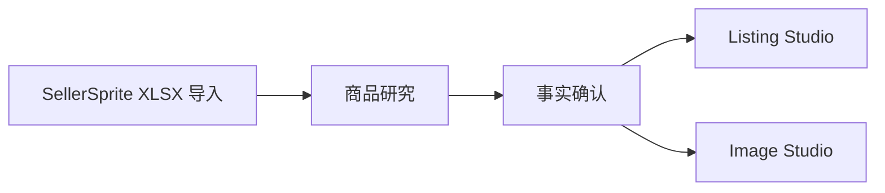

# 轻选工作台

AI 跨境商品研究与创作工作台：从 SellerSprite 数据导入、AI 商品研究、事实确认到 Listing 与图片创作的一条龙工作流。关键决策始终由人工确认。

## Overview

跨境商品研究依赖大量分散数据（报表、市场信号、产品资料），人工整理耗时且容易出错。轻选工作台把「数据整理 → 事实确认 → AI 辅助生成」组织成一条可控流程：机器处理数据与草稿，人在关键节点做决定。

系统是辅助研究工具，**不会**自动采购、上架或投放广告。

## Features

- **SellerSprite 商品数据导入** — 上传 SellerSprite XLSX，自动解析商品资料、市场信号与卖点，生成可确认的商品事实候选
- **AI 商品研究** — 对单个商品执行来源、风险、总结与 Listing 维度的研究分析
- **商品事实确认** — 人工确认哪些研究事实可用于创作，未确认内容不进入权威创作输入
- **AI Listing 生成** — 基于已确认事实生成 Listing 草稿，附质量校验与降级兜底
- **AI 图片创作** — 基于共享商品事实与已批准视觉参考生成图片草稿
- **Human-in-the-loop 工作流** — 研究决定、事实确认、Listing 与图片复核均由人工完成
- **数据隔离与安全机制** — 访客沙箱隔离、外部图片安全下载、市场信号与创作事实隔离

## How It Works



- **SellerSprite 导入**：解析 XLSX，提取商品资料与市场信号
- **商品研究**：AI 生成来源 / 风险 / 总结 / Listing 四层分析
- **事实确认**：人工勾选可进入创作的已确认事实
- **Listing Studio**：基于确认事实生成 Listing 草稿
- **Image Studio**：基于共享事实与批准参考图生成图片草稿

## Architecture

- **Frontend** — Next.js 应用，工作台 / Listing Studio / Image Studio 等页面
- **Backend** — Next.js API Routes，业务逻辑与 AI 编排
- **Database** — Prisma + SQLite，存储候选、研究记录与创作产物
- **AI Provider** — 可插拔：文本（Listing/研究）与图片（创作）独立配置，支持 Mock 模式
- **Storage** — 本地文件存储，承载图片草稿与导入数据

## Tech Stack

- Next.js 16
- React 19
- TypeScript
- Prisma 5 + SQLite
- OpenAI-compatible AI Provider（可替换）

## Getting Started

### 环境要求

- Node.js ≥ 20.9
- npm

### 安装

```bash
npm install
npx prisma generate
npx prisma db push
```

### 启动

带 SQLite 门禁的本地入口（推荐，端口 3005）：

```bash
npm run check:local   # 先验证本机端口与 SQLite 数据库就绪（不启动服务）
npm run dev:local     # 启动开发服务器（带数据库门禁）
```

浏览器打开 http://localhost:3005 进入登录页。

如只需纯开发服务器（无数据库门禁）可执行 `npm run dev`（http://localhost:3000）。

详细步骤见 [快速开始](docs/getting-started/installation.md)。

## Environment Variables

复制 `.env.example` 为 `.env.local` 并填写。完整说明见 [配置说明](docs/guides/configuration.md)。

| 变量 | 作用 |
| --- | --- |
| `ACCESS_PASSWORD` | 登录访问密码（必填） |
| `PROOF_SIGNING_SECRET` | 会话令牌签发用独立随机密钥 |
| `AI_PROVIDER` | 文本 AI Provider（`deepseek` 等） |
| `DEEPSEEK_API_KEY` / `DEEPSEEK_BASE_URL` / `DEEPSEEK_MODEL` | DeepSeek Provider 配置 |
| `LISTING_PROVIDER_MODE` / `IMAGE_PROVIDER_MODE` | `mock` 或 `real`（默认 mock，不调用真实付费 API） |
| `OPENAI_LISTING_ENABLED` | Listing AI 门禁（realAiListingGate 读取；与 `LISTING_PROVIDER_MODE=real` 同时为真才放行真实调用） |
| `OPENAI_LISTING_VISITOR_ENABLED` | 访客是否允许真实 Listing AI（默认 false） |
| `OPENAI_API_KEY` / `OPENAI_IMAGE_BASE_URL` / `OPENAI_IMAGE_MODEL` | 图片 Provider 配置 |
| `OPENAI_IMAGE_RESULT_HOSTS` | 图片下载结果域名白名单 |
| `DATABASE_URL` | SQLite 数据库路径 |
| `AI_IMAGE_DRAFT_STORAGE_ROOT` | 图片草稿存储目录 |

> 真实密钥值只存在于 `.env.local`，**绝不提交到版本库**。

## Testing

```bash
npm test          # Vitest 单元/集成测试
npm run lint      # ESLint
npx tsc --noEmit  # 类型检查
npm run build     # 生产构建
npm run check     # lint + test + build
```

测试不调用真实 AI Provider（默认 Mock），不访问生产数据库。

## Project Structure

| 目录 | 说明 |
| --- | --- |
| `app/` | Next.js 页面与 API Routes |
| `components/` | React 组件 |
| `lib/` | 业务逻辑、服务端门禁与数据层 |
| `prisma/` | Prisma Schema 与数据库 |
| `hooks/` | React Hooks |
| `scripts/` | 本地运行、验证与工具脚本 |
| `tools/` | 上游数据工具（SellerSprite、Amazon 采集等） |
| `tests/` | 测试辅助 |
| `docs/` | 项目文档 |

## Documentation

- [文档索引](docs/README.md)
- [快速开始](docs/getting-started/installation.md)
- [架构总览](docs/architecture/overview.md)
- [认证与配额契约](docs/architecture/auth-and-quota-contract.md)
- [部署手册](docs/deployment/production-runbook.md)

## V2 Freeze

V2 生产主线已正式冻结。

- **Main**: `main` = 生产基线，冻结；业务开发不再进行，仅 P0（数据破坏/凭据泄漏/认证失效/安全事故）与 P1（核心主链路不可用：登录、导入、候选保存、Listing/Image 生成、生产站访问）允许重新开启。
- **Listing Studio**: 基础生成、confirmed facts 事实边界、Claim Gate、安全 fallback、生产生成链路均可用。已确认事实（含中文/混合语言）经受控 English Rendering 转自然英文并保留 factRef 溯源；无法安全英文化时 fail-closed（拒绝生成，不静默丢事实）；最终用户可见字段经语言 Gate 校验，禁止中文与中文标点。AI optimized 草稿为 best-effort：被 Claim Evidence 或质量门拒绝时自动保留 safe structured fallback；该降级为已知限制（KNOWN_LIMITATION），不视为 blocker。
- **Experiment**: `experiment/listing-evidence-expression-v1`（commit `466e8c0`）为历史冻结实验分支，不进入 V2 基线、不部署生产；其目标（Confirmed Fact → 受控目标语言表达 → AI Listing → Claim Validation）已由 main 的 English Rendering 能力实现并覆盖，分支仅作历史追溯保留。

## Security

本项目涉及 AI Provider 密钥、访问认证、文件上传与用户数据隔离。请阅读 [SECURITY.md](SECURITY.md) 了解安全边界与报告方式。

## License

MIT License。详见 [LICENSE](LICENSE)。
