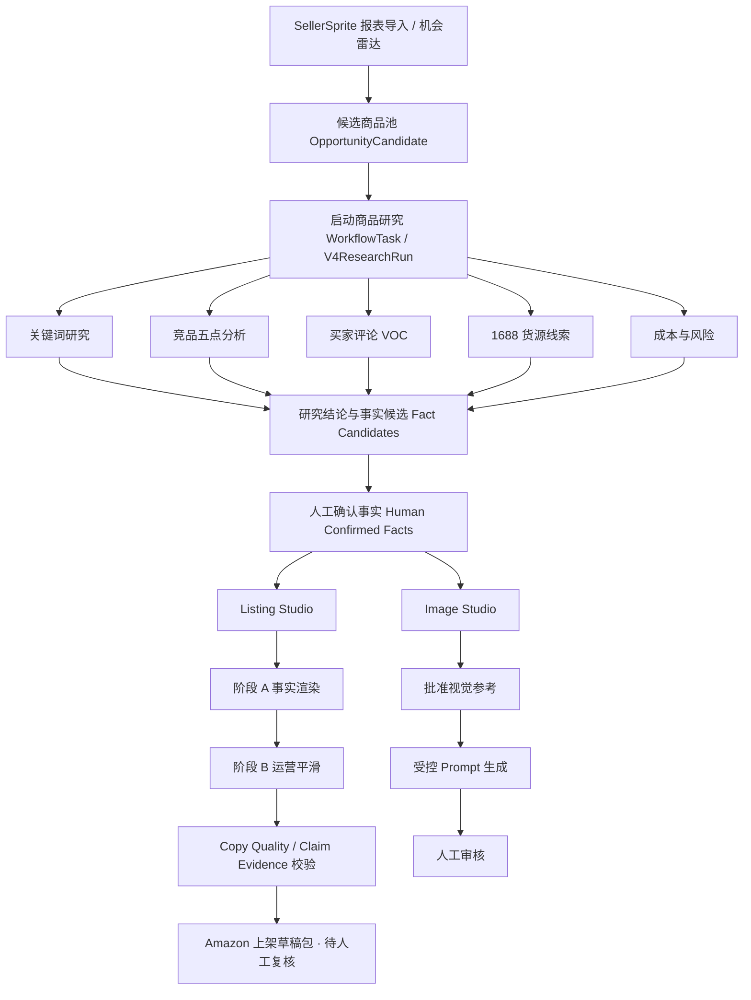
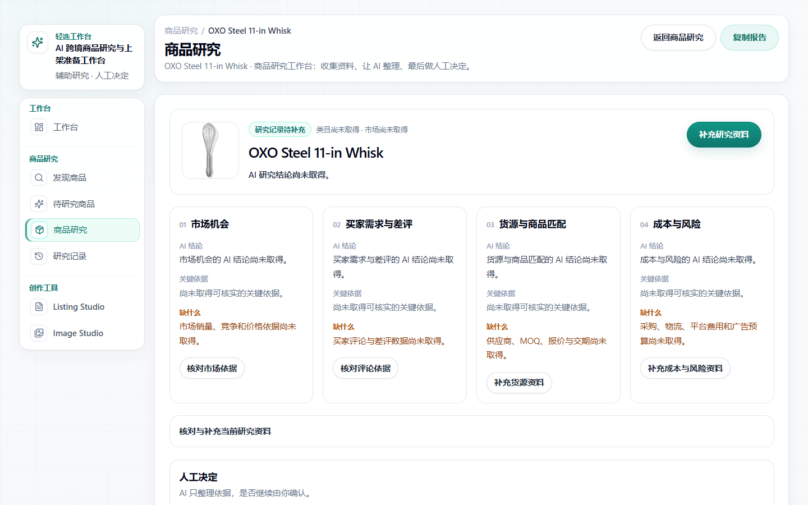
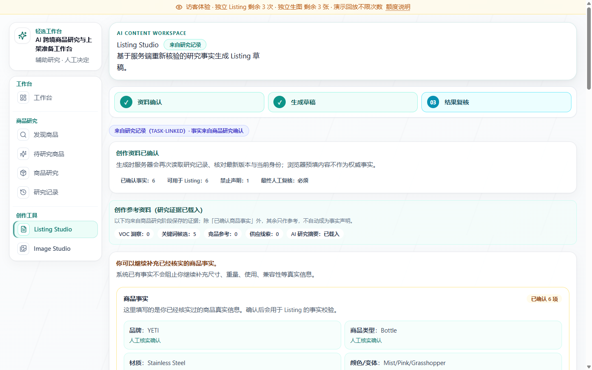
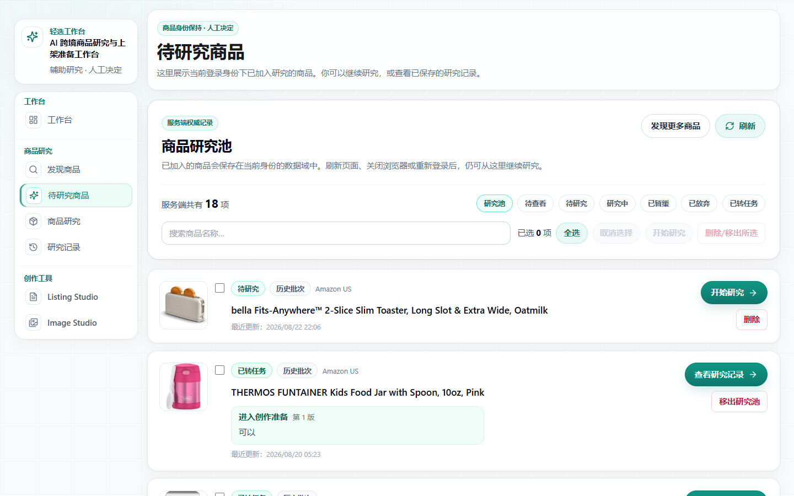
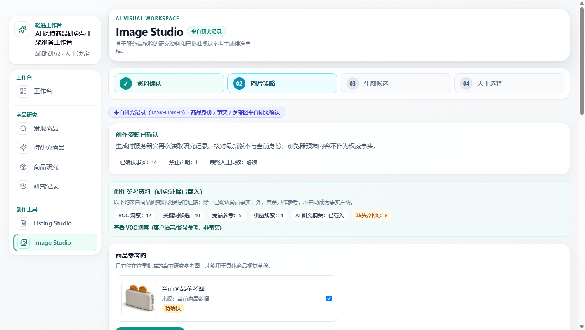

# 轻选工作台 · QingXuan Workbench

<p align="center">
  <b>Evidence-first AI workbench for cross-border product research and Amazon listing preparation</b><br>
  <i>把真实数据、证据引用、人工决策与内容生成，收敛成一条可复核、可追溯的商品研究主链。</i>
</p>

<p align="center">
  
  
  
  
  
  
</p>

<p align="center">
  
</p>

---

## 🌟 为什么做这个项目？

跨境商品研究真正困难的地方，不是“让 AI 写一段 Listing”，而是把分散、冲突、可信度不同的数据整理成**可以被人做决策、又不会污染商品事实**的输入。

这个项目重点解决三个问题：

1. **研究资料太碎**：SellerSprite、Amazon、竞品、VOC、1688、成本数据分散在不同来源，人工整理慢且容易丢上下文。
2. **AI 容易把推测写成事实**：竞品属性、评论观点、供应商声明如果直接进入 Listing，会制造事实风险。
3. **生成结果缺少可复核链路**：只看最终文案，很难回答“这句话依据什么、哪些是确认事实、哪里还缺资料”。

因此轻选工作台采用一条明确的原则：

> **Research can suggest. Human-confirmed facts can authorize. Generated copy must remain reviewable.**

---

## 🧭 核心工作流



主链不是“一键生成”，而是：

**候选商品 → 商品研究 → 证据与结论 → 人工决策 → 确认商品事实 → Listing / Image 草稿 → 人工复核。**

---

## ✨ 核心能力

| 模块 | 做什么 | 关键边界 |
| --- | --- | --- |
| 🔎 **商品研究** | SellerSprite、关键词、竞品、VOC、Amazon 页面、1688、成本与风险统一进研究工作区 | 没拿到的数据保持“未知”，不自动补 0 |
| 🧾 **Evidence Workbench** | 把来源、结论、缺口和下一步组织成可追溯证据 | 研究结论 ≠ 当前商品事实 |
| ✅ **Human Confirmed Facts** | 人工确认哪些事实可以成为创作硬输入 | 评论观点、竞品属性、供应商声明不能自动晋级 |
| ✍️ **Listing Studio** | 生成标题、五点、描述、后台搜索词，并做事实与 Copy Quality 校验 | 不合格时 fail-closed，不把碎片冒充正式稿 |
| 🖼️ **Image Studio** | 基于确认事实与已批准视觉参考生成图片草稿 | 参考图、Prompt、最终图片均保留人工审核 |
| 🛡️ **安全与隔离** | Owner 正式数据、Visitor 演示、版本冲突、Provider 开关分层控制 | 公网展示不等于本地完整生产能力 |

---

## 🖥️ 实际界面

<table>
  <tr>
    <td width="50%" align="center">
      <b>商品研究 / Evidence Workbench</b><br><br>
      
    </td>
    <td width="50%" align="center">
      <b>Listing Studio</b><br><br>
      
    </td>
  </tr>
  <tr>
    <td width="50%" align="center">
      <b>候选商品 → 研究入口</b><br><br>
      
    </td>
    <td width="50%" align="center">
      <b>Image Studio</b><br><br>
      
    </td>
  </tr>
</table>

> 截图来自真实项目验收证据。公开展示数据为脱敏快照；本地 Owner 工作台与公网 Showcase 的能力边界不同。

---

## 🧠 这个项目最重要的设计原则

### 1. Evidence-first，而不是 Prompt-first

AI 不是第一步。先拿资料、区分来源、确认缺口，再让 AI 做整理和创作。

### 2. Research ≠ Facts

关键词、评论、竞品与供应商信息可以帮助理解市场，但不能直接证明当前商品是什么。只有**人工确认事实**才能进入权威创作输入。

### 3. Fail-closed

事实不足、版本冲突、来源异常、质量校验失败时，系统宁可提示“暂无合格草稿”，也不把不可靠内容包装成完成态。

### 4. Human-in-the-loop

继续研究、补资料、确认事实、Listing 复核、图片复核都保留人工决策点。系统不会自动采购、自动上架或自动投放广告。

---

## 🚀 Quick Start

### 环境要求

- Node.js >= 20.9
- npm

### 安装

```bash
npm install
npx prisma generate
npx prisma db push
```

复制 `.env.example` 为 `.env.local`。本地安全起步建议：

```dotenv
QX_RUNTIME_MODE=local_owner
DATABASE_URL="file:./dev.db"
LISTING_PROVIDER_MODE=mock
IMAGE_PROVIDER_MODE=mock
```

### 启动本地工作台

```bash
npm run check:local
npm run start:local
```

打开 <http://localhost:3005>。

> 推荐使用带 SQLite 门禁的 `*:local` 命令管理 3005。Mock 模式不会调用真实付费 Provider。

---

## 🏗️ 技术架构

- **Frontend** — Next.js 16 + React 19 + TypeScript + Tailwind CSS
- **Backend** — Next.js Route Handlers + 服务端业务模块
- **Database** — Prisma 5 + SQLite + CAS 乐观锁版本控制
- **Workflow** — LangGraph 单一有状态 Research Workflow，保留人工中断点
- **AI Runtime** — 文本与图片 Provider 独立配置；默认 Mock，真实调用受服务端开关与配额门禁控制
- **Acquisition** — SellerSprite 导入、Amazon Browser Use、本地 1688 CLI / 浏览器助手

---

## 📂 Repository Layout

```text
ecommerce-product-ai-optimizer/
├── app/                  # Next.js 页面与 Route Handlers
├── components/           # 工作台、研究、Listing、Image UI
├── lib/                  # 业务逻辑、事实门禁、质量契约、权限与数据投影
├── prisma/               # Prisma Schema（真实数据库不提交）
├── tools/                # SellerSprite / Amazon / 1688 等采集工具
├── scripts/              # 本地运行、数据库保护、验证与部署辅助
├── docs/                 # 当前文档 + 历史工程记录 + 验收证据
├── .agents/ / .claude/   # Agent Skills / coding assistant integration
├── README.md
├── SECURITY.md
└── CHANGELOG.md
```

V4.1 的工程记录较多，统一从 [`docs/v4.1/README.md`](docs/v4.1/README.md) 进入，不需要从大量 `*_PROGRESS.md` / `*_BLOCKED.md` 文件中手工寻找当前结论。

---

## ✅ Verification

```bash
npm test
npm run lint
npx tsc --noEmit
npm run build
```

测试默认不调用真实 AI Provider，也不应写入正式业务数据库。涉及存储、浏览器或 Provider 的验收应使用隔离数据库、独立端口和明确的安全边界。

---

## 📚 Documentation

- [文档总索引](docs/README.md)
- [V4.1 文档导航](docs/v4.1/README.md)
- [快速开始](docs/getting-started/installation.md)
- [架构总览](docs/architecture/overview.md)
- [认证、权限与配额契约](docs/architecture/auth-and-quota-contract.md)
- [部署手册](docs/deployment/production-runbook.md)
- [Security](SECURITY.md)
- [Changelog](CHANGELOG.md)

---

## 🔒 Security & Product Boundary

- 真实密钥只允许存在于 `.env.local`，不得提交。
- 评论、竞品和供应商声明不能自动成为当前商品事实。
- 自动采集仅限明确授权的本机 Owner 环境；验证码、登录墙、身份错配或来源异常均失败关闭。
- `public_showcase` 是只读展示，不实时采集、不写正式数据、不代表完整本地能力。
- 本项目是**商品研究与上架准备辅助工具**，不承诺销量、利润，也不会自动采购、上架或投放广告。

---

## 📌 Project Status

- **Current product line**: V4.1
- **Core workflow**: Candidate → Research → Evidence → Human Decision → Human Confirmed Facts → Listing / Image
- **Runtime modes**: `local_owner` / `public_showcase`
- **Historical versions**: V1 / V2 / V3 / V4.0 保留 Git 历史用于追溯，不再作为当前产品说明

## License

MIT License. See [LICENSE](LICENSE).
