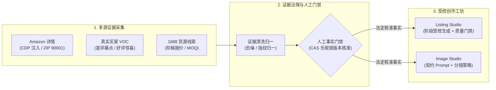

<div align="center">

# 轻选工作台 · QingXuan Workbench

**证据驱动型 AI 跨境电商商品研究与 Listing 创作工作台**<br />
*Evidence-Driven AI Commerce Workbench for Amazon Product Research & High-Converting Listings*

<p align="center">
  <a href="https://nextjs.org"></a>
  <a href="https://react.dev"></a>
  <a href="https://www.typescriptlang.org"></a>
  <a href="https://tailwindcss.com"></a>
  <a href="https://www.prisma.io"></a>
  <a href="https://vitest.dev"></a>
  <a href="LICENSE"></a>
</p>

<p align="center">
  <a href="#-核心特性">核心特性</a> •
  <a href="#-为什么选择轻选工作台">设计哲学</a> •
  <a href="#-系统架构与工作流">系统架构</a> •
  <a href="#-核心功能矩阵">功能矩阵</a> •
  <a href="#-快速上手">快速上手</a> •
  <a href="#-文档索引">完整文档</a>
</p>

</div>

---

## 📖 项目定位

**轻选工作台** 是专为跨境电商（以 Amazon 为核心）卖家打造的**本地可运行、商业级 AI 辅助工作台**。

常见的电商 AI 辅助工具通常采用“单一提示词 + 一键生成文案”的黑盒模式，在对合规与精确度要求极高的跨境电商场景中，极易产生**无源事实幻觉**（如编造 FDA 认证）、**竞品卖点抄袭**（误将竞品专有配件当成本品规格）、**机械假通过病句**以及**脱离供应链现实**等严重问题。

轻选工作台以 **“证据驱动 (Evidence-Driven)”** 与 **“人工事实门禁 (Human Gate)”** 为核心底层基石，将**市场机会发现、多源真实证据采集、人工事实裁决、受控 Listing 创作与视觉营销策划**紧密串联，构建起一条端到端可复核、防幻觉、严格契合电商合规标准的结构化作业主链。

---

## 🌟 核心特性

- 🔍 **证据优先 (Evidence First)**：无源不言。整合 SellerSprite（卖家精灵）选品报表、Amazon 标杆竞品、买家真实评论 (VOC) 与 1688 源头货源线索，彻底终结模型凭空捏造。
- 👤 **人机协同 (Human-in-the-Loop)**：AI 仅负责高速抽取与整理候选证据；商品核心物理规格（材质、尺寸、容量、结构）由运营人员人工核准打勾，系统绝不越权断言。
- 🛡️ **事实权威隔离 (Fact Authority)**：严格奉行 **`Evidence ≠ Fact`** 隔离哲学，未经人工确认的外部非标信号物理切断，绝不污染后续大模型上下文。
- 🔗 **断言全链可溯 (Claim Traceability)**：文案中宣称的每项材质、功能与参数，在确认事实库中均逐字可追溯，坚决杜绝虚构认证与参数虚标。
- 🚦 **确定性语法门禁 (Quality Gate)**：自研正则级 Copy Quality 质检引擎，解决传统“词数达标即放行”带来的假通过盲区，代码级拦截 5 类机器常见僵硬病句。

---

## 💡 为什么选择轻选工作台？

| 痛点维度 | 传统套壳 AI (Prompt-Only) | 轻选工作台 (Evidence-Driven) |
| :--- | :--- | :--- |
| **事实真实性** | 模型随意编造参数与认证，极易发生事实幻觉与虚假宣传 | **严格 Positive-Allow 门禁**：未在已核准事实库中备案的 Claim 代码级强力拦截 |
| **竞品边界** | 爬取竞品后极易把竞品的专有专利设计直接挪为本品卖点 | **实体物理隔离**：标杆竞品数据仅作参照，绝对物理隔离于本品事实库之外 |
| **文案质检** | 依赖大模型自我打分，充斥大量僵硬机器句式依然“判定通过” | **Copy Quality 正则引擎**：确定性拦截 5 类机器通病，保障地道本土语感 |
| **决策权属** | 黑盒一键全包，运营无法溯源各项生成的具体来源 | **Human Gate 机制**：AI 归纳证据，运营打勾核准并加盖 CAS 乐观并发锁 |
| **供应链现实** | 前端文案承诺极高规格，后端采购起订量 (MOQ) 或价格严重脱节 | **打通 1688 货源线索**：实时比对国内源头供应商梯队报价、起订量与材质线索 |

---

## 🏗️ 系统架构与工作流

### 核心哲学：证据不等于事实（Evidence ≠ Fact）

```text
  Evidence ≠ Fact               # 采集到的文本仅作为参考证据，不自动升格为商品事实
  VOC ≠ Fact                    # 买家评论与吐槽是主观感知，不等于商品的物理属性
  AI Summary ≠ Fact             # AI 的推演与归纳只是参谋意见，不能直接作为上架规格
  Competitor Evidence ≠ Fact    # 竞品详情页的卖点是竞品特性，严禁直接挪用至本品
  Sourcing Evidence ≠ Fact      # 1688 批发商的声明不能等同于 Amazon 最终合规规格
  Keyword Evidence ≠ Fact       # 搜索关键词只提供流量靶向，不代表商品自带该项功能
```

### 端到端受控流水线



---

## 🛠️ 核心功能矩阵

### 1. 商品机会发现 (Opportunity Discovery)
- 一键导入并解析 SellerSprite（卖家精灵）市场调研报表与搜索热词；
- 自动化解析类目体量、月销均值、价格分布带、退货率及 BSR 排名走势；
- 潜力商品沉淀至统一的候选商品池（`OpportunityCandidate`），有序推进深度调研。

### 2. 多源证据研究 (Multi-source Evidence Research)
- **Amazon 详情标杆**：通过 Chrome DevTools Protocol 注入美国真实邮区（ZIP 90001）与 USD 货币环境校准，真实抓取页面元素；
- **标杆竞品透视**：提取头部竞品的核心五点描述与差异化站位，智能剔除 Sponsored 广告干扰；
- **真实买家评论 (VOC)**：结构化提炼高频差评痛点与好评惊喜点，指导反转卖点提炼；
- **1688 供应链货源**：只读白名单调用受控 CLI，获取国内源头供应商阶梯报价与起订门槛。

### 3. 人工事实门禁 (Human Fact Gate)
- 恪守“证据不等于事实”底线，AI 整理提取出的物理属性仅作为候选凭证；
- 运营人员在工作台中逐项比对证据原文并打勾确认；
- 确认事实加盖 CAS 乐观锁版本印章，成为后续内容生成的**唯一法定事实依据**。

### 4. Listing 受控创作 (Listing Studio)
- **阶段 A 事实语义渲染**：将核准事实精准映射为结构化语义，严格锁定数字与度量单位对应关系；
- **阶段 B 运营自然润色**：融入核心关键词流量靶向，由模型转化为契合欧美消费者阅读心智的地道英文；
- 一键导出完全符合 Amazon 字符与格式规范的标题（Title）、五点（Bullets）、长描述（Description）与搜索词（Search Terms）。

### 5. 文案质量门禁 (Quality Gate)
- 内置 **Copy Quality 确定性正则引擎**，代码级拦截 5 类机器常见僵硬病句：
  - 动词机制套壳（如 `opens through its ... mechanism`）
  - 介词与短语搭配错误（如 `suitable for use at daily hydration`）
  - 场景复读口吃（如 `suitable for use at ... desk use`）
  - 主客体逻辑倒置（如 `fits cup holder-friendly base`）
  - 单数可数名词无冠词裸奔（如 `features MagSlider lid`）
- 配合 **Positive-Allow 事实检查器**，彻底杜绝无依据事实放行。

### 6. 图片营销策略 (Image Studio)
- 批准已验证主图作为受控视觉参考；
- 基于确认事实与买家使用场景，生成契约级生图提示词与多尺寸分镜方案；
- 为实拍摄影师与 3D 渲染美工提供明确、无歧义的交付标准（白底主图、结构拆解图、场景代入图等）。

---

## 📌 项目状态与演进

| 状态维度 | 当前情况 | 说明 |
| :--- | :--- | :--- |
| **当前版本** | `v4.1.0` (Product Line: V4.1) | 完整仓库主线发布版本 |
| **项目状态** | **核心流程通过本地端到端验收** | 本地完整主链通过走查验证，默认支持离线 Mock 完整闭环体验 |
| **测试验证** | **自动化测试套件 + 浏览器全量走查** | 包含 Vitest 单元/集成测试与 Playwright 双端无头浏览器验收流程 |

---

## 🚀 快速上手

### 1. 环境准备
- **Node.js**: `≥ 20.9.0`
- **npm**: `≥ 10.0.0`

### 2. 克隆与安装依赖
```bash
git clone https://github.com/a2578348864a-sys/ecommerce-product-ai-optimizer.git
cd ecommerce-product-ai-optimizer
npm install
```

### 3. 初始化本地数据库与配置
```bash
# 生成 Prisma Client 并同步本地 SQLite 数据表结构
npx prisma generate
npx prisma db push

# 复制环境变量配置文件 (默认开启免密 Mock 模式，零成本、免 API Key 体验完整闭环)
cp .env.example .env.local
```

`.env.local` 默认基础开箱配置：
```dotenv
QX_RUNTIME_MODE=local_owner
DATABASE_URL="file:./dev.db"
LISTING_PROVIDER_MODE=mock
IMAGE_PROVIDER_MODE=mock
```

### 4. 启动本地服务
```bash
# 本地服务启动 (推荐，内置环境依赖与 SQLite 门禁自检)
npm run dev:local

# 或编译后运行本地生产模式
npm run start:local
```

在浏览器中访问终端输出的本地地址（如 `http://localhost:3000` 或 `http://127.0.0.1:3005`）即可进入工作台。

### 5. 执行测试与代码门禁
```bash
# 运行 Vitest 自动化测试套件
npm run test

# 执行 TypeScript 严格类型检查
npx tsc --noEmit

# 执行 ESLint 规范扫描
npm run lint
```

---

## 💻 技术栈

| 领域分类 | 采用技术 |
| :--- | :--- |
| **前端与交互** | Next.js 16 (App Router), React 19, TypeScript 5, Tailwind CSS, Lucide Icons, Radix UI |
| **服务端与编排** | Next.js Server Actions & API Routes, Node.js 运行时, LangGraph 任务流编排 |
| **数据与持久化** | Prisma 5.22, SQLite (带 `storageVersion` CAS 乐观并发控制) |
| **采集与协议** | Chrome DevTools Protocol (CDP), 1688 受控 CLI 白名单桥接 |
| **质量与工程** | Vitest, Playwright (无头端到端走查), ESLint, TypeScript Strict |

---

## 📁 核心目录结构

```text
ecommerce-product-ai-optimizer/
├── app/                        # Next.js 16 前端页面与 80+ API 服务路由
│   ├── (studios)/              # Listing Studio 与 Image Studio 受控工坊
│   ├── opportunities/          # 市场机会发现、选品雷达与报表透视
│   ├── tasks/                  # 商品深度研究主控台 (四大证据与事实核准)
│   └── api/                    # 任务流编排、受控生成、多源采集与质检路由
├── components/                 # 模块化前端 UI 组件
│   ├── evidence/               # 证据治理、多源采集卡片与人工核准交互
│   ├── cross-border/           # 标杆竞品、买家 VOC 分析、1688 货源面板
│   └── listing-handoff/        # Listing 交互编辑器与 Copy Quality 质检面板
├── lib/                        # 核心领域业务逻辑
│   ├── server/                 # 权限契约、CAS 并发锁、Fail-Closed 防护与采集编排
│   ├── listingHandoff/         # 阶段 A 语义渲染、阶段 B 运营润色、Copy Quality 引擎
│   └── imageHandoff/           # 视觉参考匹配、契约级 Prompt 组装与分镜元数据
├── tools/                      # 外部采集实现 (Chrome CDP 采集器、卖家精灵解析器)
├── prisma/                     # SQLite 数据模型与版本字段定义 (schema.prisma)
├── docs/                       # 系统架构、业务手册、工程决策与资产库
└── scripts/                    # 本地守护进程、环境自检与安全运行脚本
```

---

## 🧭 文档索引

| 文档分类 | 文档链接 | 核心内容 |
| :--- | :--- | :--- |
| **文档总览** | [文档中心全景索引](docs/README.md) | 完整技术文档、操作指南与架构清单 |
| **系统架构** | [系统架构总览](docs/architecture/overview.md) | 分层设计、核心数据流向与组件职责划分 |
| **核心机制** | [证据链与事实隔离机制](docs/architecture/evidence-chain.md) | Evidence ≠ Fact 哲学、去噪归一与 Positive-Allow 溯源 |
| **安全并发** | [安全架构与并发控制契约](docs/architecture/security.md) | 双运行模式隔离、CAS 乐观锁版本并发与 Fail-Closed 熔断 |
| **产品场景** | [产品全景与业务场景](docs/product/product-overview.md) | 业务流程、5 大操作旅程与实际应用场景 |
| **本地开发** | [本地开发与贡献指南](docs/development/local-development.md) | 完整环境搭建、环境变量详解与代码规范 |
| **工程决策** | [关键工程决策记录 (ADR)](docs/decisions/engineering-decisions.md) | 核心设计权衡、正则质检引擎与存储选型背景 |
| **生产运维** | [生产环境部署手册](docs/deployment/production-runbook.md) | 生产部署标准流程与 PM2 守护说明 |

---

## 📄 开源许可证

本项目基于 [MIT License](LICENSE) 开源发布。
