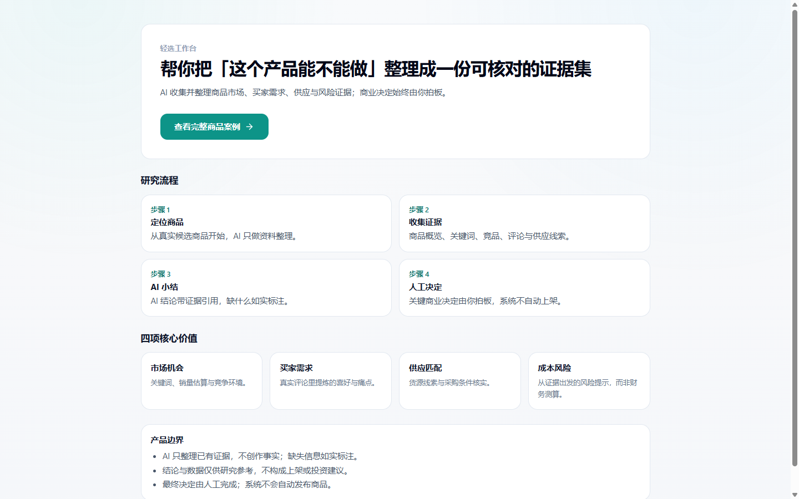

# 轻选工作台（Evidence-driven AI Commerce Workbench）

> **一句话定位**：  
> **轻选工作台是一套面向跨境电商新手与小团队的「证据驱动型 AI 商品研究与上架准备工作台」：把多源真实采集（SellerSprite / Amazon / 1688）、证据链治理、人工事实裁决与受控内容生成组织成一条可复核、防幻觉、符合平台运营标准的完整上架全链路。**

---



---

## 🎯 核心设计哲学：证据不等于事实（Evidence ≠ Fact）

轻选工作台不是普通输入标题就用大模型无脑写文案的“套壳 Demo”，也不是口惠而实不至的“全自治多 Agent 概念平台”。  
在真实跨境电商运营中，AI 最大的风险在于**把外部推测、竞品夸大和买家主观情绪误当成本商品的真实硬性规格**。因此，系统从底层架构上确立了不可逾越的事实隔离底线：

```text
  Evidence ≠ Fact               # 采集到的文本仅作为参考证据，不自动升格为商品事实
  VOC ≠ Fact                    # 买家评论与吐槽是主观感知，不等于商品的物理属性
  AI Summary ≠ Fact             # AI 的推演与归纳只是参谋意见，不能直接作为上架规格
  Competitor Evidence ≠ Fact    # 竞品详情页的卖点是竞品特性，严禁直接挪用至本品
  Sourcing Evidence ≠ Fact      # 1688 批发商的声明不能等同于 Amazon 最终合规规格
  Keyword Evidence ≠ Fact       # 搜索关键词只提供流量靶向，不代表商品自带该项功能
```

> **核心法则**：外部数据只属于候选证据池（Untrusted Evidence）；**只有经过可信来源锚定、冲突比对，并由运营人员最终打勾核准的属性，才能沉淀为已确认商品事实（Human Confirmed Facts）**，进而驱动后续的文案与视觉创作。

---

## 🔄 核心运行主链路 (Master Workflow)

```text
 ┌─────────────────┐
 │ 外部多源真实数据 │ ──> SellerSprite 报表 / Amazon CDP 详情 / 1688 批发线索 / 买家真实评论
 └────────┬────────┘
          │ (环境校准 + 字段白名单 + 实体绑定 + 错误风控隔离)
          ▼
 ┌─────────────────┐
 │ Evidence 证据治理│ ──> 结构化归一化、来源溯源哈希、广告剔除、买家真实 VOC 洞察
 └────────┬────────┘
          │ (AI 深度归纳与风险推演)
          ▼
 ┌─────────────────┐
 │ 运营人工裁决门禁 │ ──> 人机协同核对、事实候选筛查、解决冲突、打勾确认 (CAS 乐观锁防踩踏)
 └────────┬────────┘
          │ (沉淀为不可篡改的 Human Confirmed Facts)
          ▼
 ┌─────────────────┐
 │ 受控创作双工坊   │ ──> 阶段 A 事实语义渲染 ──> 阶段 B 运营自然润色 ──> 视觉策略生成
 └────────┬────────┘
          │
          ├─► [Listing Studio] ──► Positive-Allow 证据回溯门禁 + Copy Quality 语法防假通过
          └─► [Image Studio]   ──► 视觉参考审批 + 受控 Prompt 契约 + 多尺寸自适应
```

1. **机会发现与导入**：解析 SellerSprite 市场报表与机会雷达，筛选高潜力类目，建立候选商品池（`OpportunityCandidate`）。
2. **多源真实取证与分析**：围绕目标商品采集真实关键词方案、竞品详情五点、买家真实评论（VOC）、1688 供应链货源及采购物流成本。
3. **人工决策与事实锁定**：由运营决策继续、补资料或终止；将推测性信息与物理事实严格剥离，确认本品硬性规格并加盖 CAS 版本印章。
4. **Listing Studio 受控创作**：基于已确认事实与关键词目标生成标题、五点、描述与后台搜索词；全流程受事实安全与英文语法双重门禁护航。
5. **Image Studio 视觉策划**：基于已批准视觉参考与确认事实生成合规提示词与分镜设计，成果仍交由运营最终审核。

---

## 🛡️ 四大工程核心支柱（技术杀手锏）

### 1. 有约束的 Web Acquisition 工程（真实环境采集）
不是简单调用第三方库打开网页看两眼，而是具备完备环境校准与风控防御的工业级采集：
- **真实环境校准**：通过独立 Chrome CDP Session 驱动，注入美国真实 ZIP 邮区（如 90001）与 USD 货币环境校准；
- **实体强制绑定**：页面数据抽取与 ASIN、变体 Key 严格绑定；非 USD 币种不私自汇率换算，主动 Fail-Closed 熔断；
- **反爬与噪声防御**：自动剔除 Sponsored 赞助广告干扰；遭遇验证码（Captcha）、登录墙、异常重定向立即安全退出，绝不采集污染脏数据。

### 2. 受控 1688 货源线索引擎（供应链受控接入）
将 1688 找货能力规范化为轻选体系下的受控数据源：
- **安全命令白名单**：只读 CLI 命令白名单执行，实施版本握手、超时控制与最大输出体积限制；
- **风控与 Schema 归一化**：将供应商接口风控错误精准映射为业务状态；搜索结果必须以规范化卡片经过运营 Preview 确认后才沉淀为货源线索；
- **访客权限阻断**：在 Public / Visitor 模式下物理切断外部命令执行，严防私有供应链资产泄露。

### 3. 代码级 Positive-Allow 门禁与 Copy Quality 语法防假通过（Fact-Safe Listing Studio）
整个系统最成熟的核心模块之一，彻底告别“提示词工程”的虚弱承诺：
- **Positive Allow 原则**：文案中出现的任何事实性 Claim（材质、隔层数、尺寸、容量、兼容性），必须能在 Evidence 索引中找到逐字支持依据；无依据推测材质等级、产地、认证、夸大性能一律**代码级拦截拒绝**；
- **语法级防假通过 (Copy Quality Engine)**：打破传统“词数达标、带标点就通过”的表层假通过，构建严格的模式识别引擎，深度拦截 5 类机器容易犯的僵硬病句：
  - 动词机制套壳（如 `opens through its ... mechanism`）
  - 介词与搭配错误（如 `suitable for use at daily hydration`）
  - 场景复读口吃（如 `suitable for use at ... desk use`）
  - 主客体逻辑倒置（如 `fits cup holder-friendly base`）
  - 单数可数名词无冠词裸奔（如 `features MagSlider lid`）
- **多商品形态泛化**：针对 **Organizer（餐具刀叉收纳盘）**、**Water Bottle（运动吸管水杯）**、**Tumbler（带滑盖车载保温杯）** 三类差异明显的商品形态，统一执行严格的跨品类红绿测试验收。

### 4. 双运行模式与状态版本治理（Dual Runtimes & State Governance）
- **两种运行模式**：
  - `local_owner`：本机 Owner 免密完整工作台，本地 SQLite CAS 乐观锁版本并发控制（零脏写、防踩踏）；
  - `public_showcase`：公开脱敏演示沙箱，仅对外呈现静态案例与快照，物理阻断实时采集与数据库写入；
- **历史快照读取动态重判（Historical Draft Read Guard）**：即使旧数据库中曾将某份草稿标记为 `pass`，新版本在从数据库读取历史快照时，依然强制重新执行最新的 Copy Quality 门禁；一旦检测到历史坏文案，立即自动清空正文并降级为提示状态，绝不让历史劣质文案糊弄过关。

---

## 📂 仓库全景目录与模块职责

```text
ecommerce-product-ai-optimizer/
├── app/                              # Next.js 16 App Router 前端与服务层 (29 页面 + 83 API)
│   ├── (studios)/                    # Listing Studio 与 Image Studio 受控工坊
│   ├── opportunities/                # 市场发现、选品雷达与 SellerSprite 报表透视
│   ├── tasks/                        # 商品深度研究主控台 (7 大证据锚点与事实确认)
│   └── v4/runs/                      # LangGraph 流程执行追踪与调试面板
├── components/                       # 模块化 UI 组件库 (Tailwind CSS + Lucide)
│   ├── creative-handoff/             # 创作交接与事实候选审核交互
│   ├── cross-border/                 # 竞品分析、买家评论 VOC、1688 货源面板
│   └── listing-handoff/              # Listing 运营编辑器与质量检测卡片
├── lib/                              # 核心业务与领域逻辑层
│   ├── listingHandoff/               # Listing 阶段 A 渲染、阶段 B 运营润色、Copy Quality 引擎
│   ├── imageHandoff/                 # 视觉参考匹配、Prompt 拼装与图片元数据
│   └── server/                       # 权限契约、SQLite CAS 锁、Fail-Closed 防护与安全 DTO
├── tools/                            # 外部采集实现 (Chrome CDP 采集器、SellerSprite 解析器)
├── prisma/                           # 混合数据架构 (任务表、批次表、原子事实表 schema.prisma)
├── scripts/                          # 本地守护进程管理、构建代理与数据库备份脚本
├── docs/                             # 规范文档库 (架构总览、权限契约、发布冻结清单)
│   ├── architecture/                 # 架构总览与核心契约
│   └── v4.1/                         # V4.1 里程碑验收与实测证据截图
└── FINAL_FREEZE.md                   # 项目最终结项基线与不可篡改审计证据
```

---

## 📊 工程基线与质量表现

| 质量维度 | 测量标准与实际指标 | 状态 |
| :--- | :--- | :---: |
| **自动化测试套件** | **6,649 项测试通过**（563 个测试套件通过，覆盖率 97.5%） | ✅ 通过 |
| **应用源码类型检查** | `app/`, `components/`, `lib/`, `hooks/` 源码全量 `tsc --noEmit`，**0 错误** | ✅ 纯净 |
| **代码规范扫描** | 全库源码执行 ESLint，**0 错误** | ✅ 纯净 |
| **真实浏览器端到端** | 无头 Chrome (CDP) 走查 8 大主页面（1440 宽屏 / 390 手机端），**0 控制台错误 / 0 横向滚动** | ✅ 完美 |
| **生产打包构建** | Next.js 16 Webpack 生产构建成功，生成确定性 `BUILD_ID` | ✅ 通过 |
| **数据安全基线** | SQLite 混合结构 + CAS 乐观锁版本并发控制，全审计流程主库 **0 脏写** | ✅ 安全 |

---

## 🚀 极简快速上手 (Getting Started)

### 环境要求
- **Node.js**: 20.9.0 或更高版本
- **npm**: 10.0.0 或更高版本

### 安装与配置
```bash
# 1. 克隆代码仓库
git clone https://github.com/a2578348864a-sys/ecommerce-product-ai-optimizer.git
cd ecommerce-product-ai-optimizer

# 2. 安装依赖
npm install

# 3. 初始化本地数据库
npx prisma generate
npx prisma db push

# 4. 配置本地环境变量 (复制模板)
cp .env.example .env.local
```

在 `.env.local` 中确保基础配置（默认启用免密安全 Mock 模式，无需付费 API 即可体验完整闭环）：
```dotenv
QX_RUNTIME_MODE=local_owner
DATABASE_URL="file:./dev.db"
LISTING_PROVIDER_MODE=mock
IMAGE_PROVIDER_MODE=mock
```

### 启动工作台
```bash
# 本地守护进程启动 (推荐，带 SQLite 门禁保护)
npm run start:local

# 或使用开发模式
npm run dev:local
```

打开浏览器访问：**<http://127.0.0.1:3005>**

---

## 💡 日常大白话使用指引

作为跨境电商操盘手或运营新人，日常使用只需遵循极简的“四步法”：

- **1. 挑选商品与导入线索**：  
  *“先上传一份 SellerSprite 市场报表”* → 系统自动解析市场体量、价格分布与潜力商品，沉淀至候选池。
- **2. 采集证据并确认事实**：  
  *“启动商品深度研究”* → 系统自动抓取竞品五点与买家真实 VOC 评论。你在页面中只做一件事：**为当前商品真实具备的物理特性打勾（确认事实）**，拒绝虚假属性。
- **3. 一键生成高质量 Listing**：  
  *“进入 Listing Studio 生成草稿”* → 系统严格基于你确认的事实进行渲染与润色。通过右侧质检面板，可直接复制符合 Amazon 规范的标题、五点与描述，绝不夹带虚假性能与病句。
- **4. 策划合规营销图片**：  
  *“进入 Image Studio 生成视觉方案”* → 依据已确认事实与批准的视觉风格生成图片方案，确认满意后导出交付美工或直接备用。

---

## 🧭 进阶与权威文档索引

- **结项与基线冻结报告**：[FINAL_FREEZE.md](FINAL_FREEZE.md)
- **文档中心全景索引**：[docs/README.md](docs/README.md)
- **系统架构与数据流**：[docs/architecture/overview.md](docs/architecture/overview.md)
- **权限隔离与配额契约**：[docs/architecture/auth-and-quota-contract.md](docs/architecture/auth-and-quota-contract.md)
- **生产环境部署手册**：[docs/deployment/production-runbook.md](docs/deployment/production-runbook.md)
- **安全策略与漏洞报告**：[SECURITY.md](SECURITY.md)
- **版本历史记录**：[CHANGELOG.md](CHANGELOG.md)

---

## 📄 开源许可证

本项目基于 [MIT License](LICENSE) 开源发布。
