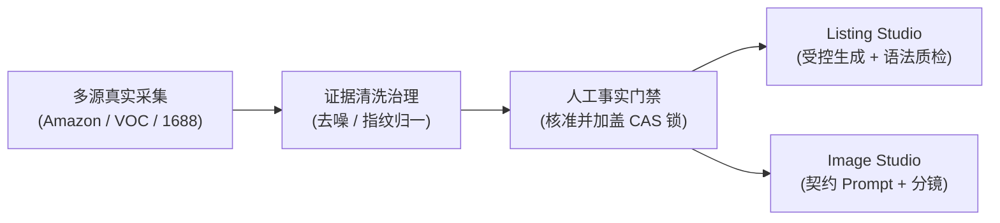
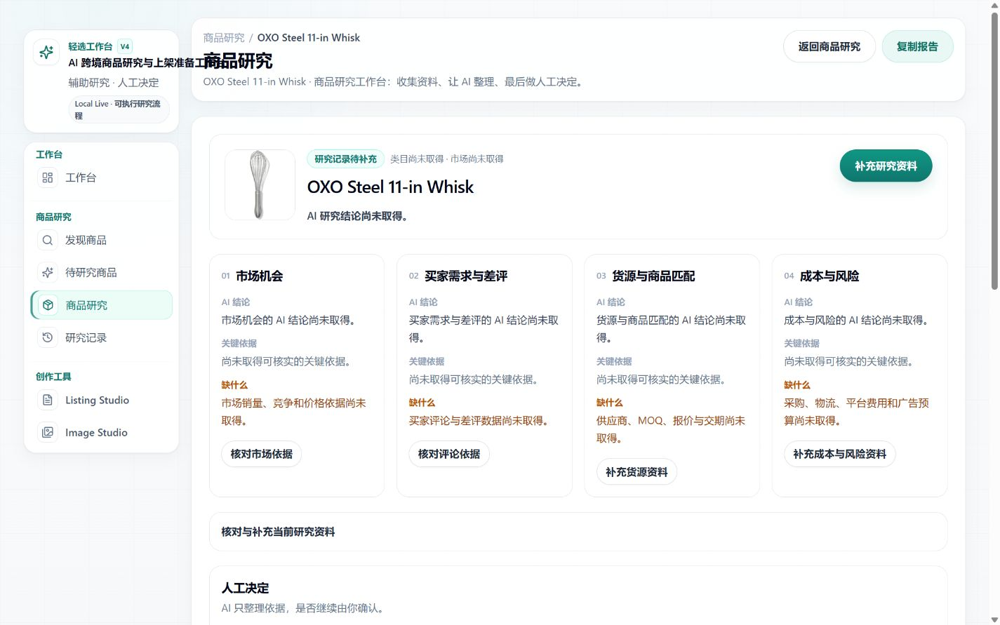

# 轻选工作台

> **证据驱动的 AI 跨境电商商品研究与 Listing 优化工作台。**<br />
> Evidence-driven AI Commerce Workbench for Amazon Product Research & Listing Optimization.

<p align="left">
  
  
  
  
  
  
</p>

---

## ⚡ 核心差异化特性 (Core Differentiators)

- 🔍 **Evidence First (证据优先)**：整合 SellerSprite 选品报表、Amazon 标杆竞品、买家真实评论 (VOC) 与 1688 批发货源，拒绝无源捏造；
- 👤 **Human-in-the-loop (人机协同)**：AI 仅负责抽取与整理候选证据，商品核心物理规格由运营人员打勾确认，系统绝不越权断言；
- 🛡️ **Fact Authority (事实权威)**：严格遵循 **`Evidence ≠ Fact`** 隔离哲学，未经核准的外部信号物理切断，绝不污染生成上下文；
- 🔗 **Claim Evidence (断言可溯)**：文案中宣称的每项参数、材质与容量，在确认事实库中逐字可查，杜绝 AI 虚构认证与参数等级；
- 🚦 **Quality Gate (代码级语法门禁)**：自研正则级 Copy Quality 语法引擎，解决传统“词数达标即放行”带来的假通过问题，拦截 5 类机器常见僵硬病句。





### 🚀 极简快速启动 (Quick Start)

```bash
# 1. 克隆代码与安装依赖
git clone https://github.com/a2578348864a-sys/ecommerce-product-ai-optimizer.git
cd ecommerce-product-ai-optimizer
npm install

# 2. 初始化本地数据库与配置文件 (默认 Mock 模式，零成本免 Key 体验)
npx prisma generate && npx prisma db push
cp .env.example .env.local

# 3. 启动本地开发服务 (带环境门禁保护)
npm run dev:local
```
浏览器访问终端打印的本地地址（如 `http://localhost:<PORT>`）即可进入完整工作台。

---

## 📖 项目介绍

**轻选工作台** 是面向跨境电商商品研究与 Amazon 上架准备的本地可运行 AI 辅助工作台。

常见的电商 AI 辅助工具通常采用“单一提示词 + 一键生成文案”方案，容易产生未经证实的材质宣称、重复套话或脱离采购规格的参数。轻选工作台将**市场机会发现、多源证据采集、人工事实裁决、受控 Listing 创作与图片营销策划**组织成一条可复核、符合电商平台内容合规要求的结构化作业主链。

---

## 📌 项目状态 (Project Status)

| 状态维度 | 当前情况 | 说明 |
| :--- | :--- | :--- |
| **当前版本** | `v4.1.0` (Product line: V4.1) | 完整源码仓库主线版本 |
| **项目状态** | **核心流程已完成并通过本地验收** | 本地完整主链通过端到端走查，支持离线 Mock 完整闭环 |
| **测试验证** | **包含自动化测试与浏览器验收流程** | 涵盖单元测试、集成测试与浏览器端到端走查（详细测试指标见开发文档） |

### 核心流程完成情况

- [x] **商品机会发现**：SellerSprite（卖家精灵）市场报表解析与候选商品池入库
- [x] **多源证据采集**：Amazon 页面（US ZIP 90001 校准）、标杆竞品、买家真实 VOC 评论、1688 受控货源线索
- [x] **人工事实门禁 (Human Gate)**：事实候选人工比对确认、CAS 乐观锁版本并发保护
- [x] **Listing Studio**：受控生成流水线（阶段 A 语义渲染 + 阶段 B 运营润色），支持 Title / Bullets / Description / Search Terms
- [x] **文案质量控制 (Quality Gate)**：Copy Quality 正则级语法引擎（拦截 5 类僵硬病句）+ Positive-Allow 事实溯源
- [x] **营销与文案策略层**：Marketing Intelligence（竞品差异化与痛点反转）+ Copy Strategy 分层体系
- [x] **Image Studio**：视觉参考图审批 + 契约级生图 Prompt 与分镜策略生成

---

## ❓ 为什么需要这个系统

在实际跨境电商商品上架与合规要求下，大语言模型直接撰写 Listing 存在以下常见问题：

| 常见问题 | 潜在风险 | 轻选工作台处理方式 |
| :--- | :--- | :--- |
| **事实幻觉与虚构认证** | 模型随意编造“FDA Approved”、“316医用不锈钢”，导致侵权下架或退货 | **严格 Positive-Allow 门禁**：未在已核实事实库中备案的 Claim 一律代码级拦截 |
| **竞品卖点直接挪用** | 爬取竞品后把竞品的独家专利设计、专有配件直接抄成本品文案 | **实体严格隔离**：标杆竞品数据仅作为定位参考，物理隔离于本品事实库之外 |
| **机器味浓与语法病句（假通过）** | 文案充斥“opens through its mechanism”等僵硬句式，传统“字数达标即放行”无法质检 | **Copy Quality 正则级语法引擎**：自研模式库拦截 5 类机器通病，保障本土化语感 |
| **脱离采购与供应链** | 前端文案承诺高规格，后端采购起订量 (MOQ) 或价格严重超标 | **受控 1688 供应链对接**：实时比对国内源头供应商梯队报价、起订量与材质线索 |

---

## 🛠️ 核心能力

### 1. 商品机会发现 (Opportunity Discovery)
- 一键导入 SellerSprite（卖家精灵）市场调研报表或搜索热词；
- 自动化解析类目体量、月销均值、价格分布带、退货率及 BSR 排名趋势；
- 潜力商品沉淀至统一的候选商品池（`OpportunityCandidate`），有序推进深度调研。

### 2. 多源证据研究 (Multi-source Evidence Research)
- **Amazon 详情标杆**：通过 Chrome DevTools Protocol 注入美国真实邮区（ZIP 90001）与 USD 货币环境校准，真实抓取页面元素；
- **标杆竞品透视**：提取类目头部竞品的五点描述与差异化站位，剔除 Sponsored 广告干扰；
- **真实买家评论 (VOC)**：结构化归纳多页买家真实评价，提炼高频差评痛点与好评惊喜点；
- **1688 供应链货源**：只读白名单调用受控 CLI，获取源头供应商阶梯报价与起订门槛。

### 3. 人工事实确认 (Human Fact Gate)
- 恪守“证据不等于事实”底线，AI 整理提取出的属性（材质、尺寸、容量、结构）仅作为候选；
- 运营人员在界面中逐项比对证据原文并打勾确认；
- 确认事实加盖 CAS 乐观锁版本印章，成为后续内容生成的唯一法定事实依据。

### 4. Listing 受控生成 (Listing Studio)
- **阶段 A 事实语义渲染**：将核准事实精准映射为结构化语义，严格锁定数字与度量单位对应关系；
- **阶段 B 运营自然润色**：融入核心关键词流量靶向，由模型转化为契合欧美消费者阅读心智的地道英文；
- 一键导出完全符合 Amazon 字符与格式规范的标题（Title）、五点（Bullets）、长描述（Description）与搜索词（Search Terms）。

### 5. 文案质量控制 (Quality Gate)
- 内置 **Copy Quality 语法引擎**，正则级拦截 5 类机器常见僵硬病句：
  - 动词机制套壳（如 `opens through its ... mechanism`）
  - 介词与短语搭配错误（如 `suitable for use at daily hydration`）
  - 场景复读口吃（如 `suitable for use at ... desk use`）
  - 主客体逻辑倒置（如 `fits cup holder-friendly base`）
  - 单数可数名词无冠词裸奔（如 `features MagSlider lid`）
- 配合 **Positive-Allow 检查器**，彻底杜绝无依据事实放行。

### 6. 图片营销策略 (Image Studio)
- 批准已验证主图作为受控视觉参考；
- 基于确认事实与买家使用场景，生成契约级生图提示词与多尺寸分镜方案；
- 为实拍摄影师与 3D 渲染美工提供明确、无歧义的交付标准（白底主图、结构拆解图、场景代入图等）。

---

## 🏗️ 核心架构

### 核心哲学：证据不等于事实（Evidence ≠ Fact）

```text
  Evidence ≠ Fact               # 采集到的文本仅作为参考证据，不自动升格为商品事实
  VOC ≠ Fact                    # 买家评论与吐槽是主观感知，不等于商品的物理属性
  AI Summary ≠ Fact             # AI 的推演与归纳只是参谋意见，不能直接作为上架规格
  Competitor Evidence ≠ Fact    # 竞品详情页的卖点是竞品特性，严禁直接挪用至本品
  Sourcing Evidence ≠ Fact      # 1688 批发商的声明不能等同于 Amazon 最终合规规格
  Keyword Evidence ≠ Fact       # 搜索关键词只提供流量靶向，不代表商品自带该项功能
```

### 传统 AI 生成 vs 轻选工作台治理

| 比较维度 | 传统套壳 AI (Prompt-only) | 轻选工作台 (Evidence-driven) |
| :--- | :--- | :--- |
| **事实依据** | 模型参数知识或模糊网页推测（幻觉高发） | **严格 Positive-Allow**，每条事实在证据索引中逐字可溯 |
| **竞品卖点** | 易把竞品专属专利卖点误作本品卖点 | **实体隔离**，竞品五点仅作参考，不进入本品事实库 |
| **文案质检** | 模型自我打分，易发生假通过与僵硬句式 | **Copy Quality 确定性正则引擎**，代码级拦截 5 类病句 |
| **人工参与** | 全黑盒一键生成，运营无法溯源核对 | **Human Gate 人机协同**，运营打勾核准并加盖 CAS 锁 |
| **供应链** | 完全脱节，不考虑生产现实 | **打通 1688 货源线索**，锁定起订量、毛利与交期 |

---

## 💻 技术栈

- **前端技术栈**：Next.js 16 (App Router), React 19, TypeScript 5, Tailwind CSS, Lucide Icons, Radix UI
- **服务端与编排**：Next.js Server Actions & API Routes, Node.js, LangGraph 编排追踪
- **数据与持久化**：Prisma 5.22, SQLite (带 `storageVersion` CAS 乐观并发控制)
- **采集与协议**：Chrome DevTools Protocol (CDP), 1688 受控 CLI 白名单桥接
- **工程与测试**：Vitest (自动化测试套件), Playwright (浏览器端到端验收), ESLint, TypeScript Strict

---

## 📁 系统结构

```text
ecommerce-product-ai-optimizer/
├── app/                        # Next.js 16 前端页面与 80+ API 服务路由
│   ├── (studios)/              # Listing Studio 与 Image Studio 受控工坊
│   ├── opportunities/          # 市场机会发现、选品雷达与报表透视
│   ├── tasks/                  # 商品深度研究主控台 (四大多源证据与事实核准)
│   └── api/                    # 任务管理、多源编排、受控生成与质检路由
├── components/                 # 模块化 UI 组件库
│   ├── evidence/               # 证据治理、采集卡片与人工确认交互
│   ├── cross-border/           # 标杆竞品、买家 VOC 分析、1688 货源卡片
│   └── listing-handoff/        # Listing 协同编辑器与文案质量检测仪表板
├── lib/                        # 领域业务服务层
│   ├── server/                 # 权限契约、CAS 并发锁、Fail-Closed 防护与采集编排
│   ├── listingHandoff/         # 阶段 A 语义渲染、阶段 B 运营润色、Copy Quality 引擎
│   └── imageHandoff/           # 视觉参考匹配、Prompt 拼装与图片分镜元数据
├── tools/                      # 外部采集实现 (Chrome CDP 采集器、SellerSprite 解析器)
├── prisma/                     # SQLite 数据模型与版本号字段定义 (schema.prisma)
├── docs/                       # 系统架构、业务手册、工程决策与资产库
└── scripts/                    # 本地守护进程、环境自检与安全运行脚本
```

---

## 🚦 快速启动 (Getting Started)

### 1. 环境准备
- **Node.js**: `≥ 20.9.0`
- **npm**: `≥ 10.0.0`

### 2. 克隆与安装
```bash
git clone https://github.com/a2578348864a-sys/ecommerce-product-ai-optimizer.git
cd ecommerce-product-ai-optimizer
npm install
```

### 3. 初始化数据库与配置
```bash
# 生成 Prisma Client 并同步 SQLite 数据库表结构
npx prisma generate
npx prisma db push

# 复制环境变量配置文件 (默认开启免密 Mock 模式，零成本体验完整闭环)
cp .env.example .env.local
```

`.env.local` 默认基础配置：
```dotenv
QX_RUNTIME_MODE=local_owner
DATABASE_URL="file:./dev.db"
LISTING_PROVIDER_MODE=mock
IMAGE_PROVIDER_MODE=mock
```

### 4. 运行工作台
```bash
# 本地服务启动 (推荐，内置环境依赖与 SQLite 门禁自检)
npm run dev:local

# 或使用本地生产模式
npm run start:local
```

打开浏览器访问终端打印的本地服务地址（例如 `http://localhost:<PORT>`）即可开始使用。

### 5. 运行测试套件
```bash
# 执行全量自动化测试套件
npm run test

# 执行 TypeScript 类型严格检查
npx tsc --noEmit

# 执行 ESLint 规范扫描
npm run lint
```

---

## 🧭 文档索引 (Documentation)

| 文档分类 | 文档链接 | 核心内容 |
| :--- | :--- | :--- |
| **文档总览** | [文档中心全景索引](docs/README.md) | 完整技术文档、操作指南与架构清单 |
| **系统架构** | [系统架构总览](docs/architecture/overview.md) | 分层设计、核心数据流向与组件职责划分 |
| **核心机制** | [证据链与事实隔离机制](docs/architecture/evidence-chain.md) | Evidence ≠ Fact 哲学、去噪归一与 Positive-Allow 溯源 |
| **安全并发** | [安全架构与并发控制契约](docs/architecture/security.md) | 双运行模式隔离、CAS 乐观锁版本并发与 Fail-Closed 熔断 |
| **产品场景** | [产品全景与业务场景](docs/product/product-overview.md) | 业务流程、5 大操作旅程与实际应用场景 |
| **本地开发** | [本地开发与贡献指南](docs/development/local-development.md) | 完整环境搭建、环境变量详解与代码规范 |
| **工程决策** | [关键工程决策记录 (ADR)](docs/decisions/engineering-decisions.md) | 核心设计权衡、正则质检引擎与存储选型背景 |
| **生产运维** | [生产环境部署手册](docs/deployment/production-runbook.md) | 生产部署标准流程与 PM2 守护说明 |

---

## 📄 开源许可证

本项目基于 [MIT License](LICENSE) 开源发布。
