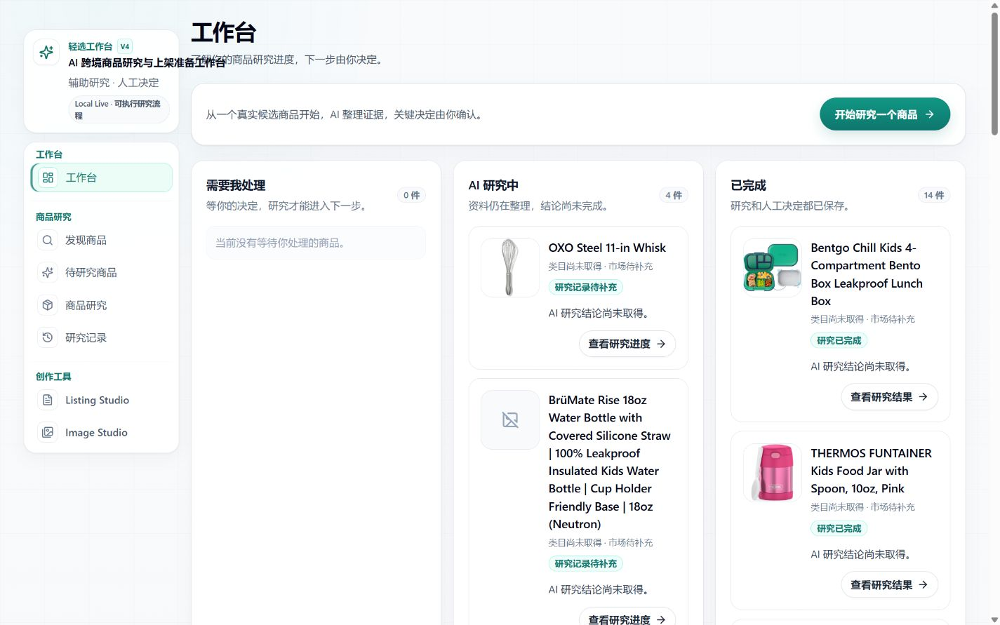

# 轻选工作台

轻选工作台是一个面向跨境电商运营的 Evidence-driven AI Workbench。它把商品研究、证据整理、人工事实确认、Listing 创作和图片准备放在一条可追溯的工作流中，让每一条对外表达都能回到已经确认的商品事实。



## 项目定位

轻选工作台帮助运营人员把研究资料整理成可复核的 Amazon 上架准备稿。系统区分三类信息：

- **证据（Evidence）**：来自 Amazon、关键词、竞品、VOC 和供应链等研究来源的原始或整理后材料。
- **确认事实（Confirmed Facts）**：经过人工逐项确认、允许进入创作链的商品客观事实。
- **表达策略（Strategy）**：目标买家、购买场景、卖点顺序和语气等表达参考，只指导如何组织文案，不会变成商品事实。

Listing 和图片结果都需要人工复核后才能用于发布。项目不承诺转化率、CTR 或 CVR 提升。

## 当前稳定主链

```text
Research sources
  → Evidence / Preview
  → Fact Candidates
  → Human Confirm
  → Confirmed Facts
  → Research Lifecycle
  → Creative Handoff
  → Listing V5 Blueprint
  → approvedBenefits
  → Writer
  → Validator / bounded repair
  → Snapshot persistence
  → API readback
  → Listing Studio / Research Detail
```

事实确认是创作的准入门槛。未确认内容不会进入商品事实集合，也不能通过策略层、关键词或竞品资料绕过 Claim Evidence 和 Quality Gate。

## 产品能力

- **商品研究**：统一收集关键词、竞品、买家反馈（VOC）、Amazon 资料和供应链线索。
- **证据工作台**：为每条候选事实保留来源和版本信息，支持人工确认、拒绝和刷新恢复。
- **Listing Studio**：基于 Confirmed Facts 生成英文 Title、Bullets、Description 和 Search Terms；结果保留证据追踪和人工复核状态。
- **Image Studio**：基于已批准的视觉参考和确认事实准备图片方向与分镜方案。
- **Research Lifecycle**：统一呈现采集、待确认、研究完成和创作就绪状态。
- **安全边界**：外部文本、竞品表达、社会证明和营销策略不会自动晋升为商品属性、认证或性能声明。

## 文档索引

- [文档中心](docs/README.md)
- [系统架构总览](docs/architecture/overview.md)
- [证据链与事实隔离](docs/architecture/evidence-chain.md)
- [安全体系与并发控制](docs/architecture/security.md)
- [Listing V5 最终收口说明](docs/listing-v5/FINAL_CLOSE_V9.md)
- [产品全景与业务场景](docs/product/product-overview.md)
- [本地开发与贡献](docs/development/local-development.md)
- [快速安装](docs/getting-started/installation.md)
- [环境变量配置](docs/guides/configuration.md)
- [核心工作流](docs/guides/workflow.md)
- [工程决策记录](docs/decisions/engineering-decisions.md)
- [部署文档（公开前需按环境脱敏）](docs/deployment/initial-deploy.md)
- [历史归档](docs/archive/README.md)

历史版本和阶段性验收材料只用于追溯，不代表当前生产主链。它们位于 `docs/archive/`，不会作为默认用户入口。

## 快速上手

### 环境要求

- Node.js `>= 20.9.0`
- npm `>= 10`
- Git
- macOS、Linux 或 Windows 10/11（PowerShell / WSL2 均可）

### 安装与本地数据库

```bash
git clone https://github.com/a2578348864a-sys/ecommerce-product-ai-optimizer.git
cd ecommerce-product-ai-optimizer
npm ci
npx prisma generate
npx prisma db push
```

`prisma db push` 只用于初始化本地 SQLite 数据库。请勿对生产数据库运行该命令，也不要提交 `.env.local` 或数据库文件。

### 配置环境变量

```bash
cp .env.example .env.local
```

默认配置使用 `mock` 模式，不需要外部 Provider key 即可体验本地工作流。只有在明确授权并选择真实 Provider 时，才填写对应的密钥；密钥只保存在本地环境变量中。

常用配置包括：

- `QX_RUNTIME_MODE`：`local_owner` 或 `public_showcase`。
- `DATABASE_URL`：本地 SQLite 文件路径。
- `LISTING_PROVIDER_MODE`、`IMAGE_PROVIDER_MODE`：`mock` 或 `real`。
- `AI_PROVIDER`：真实文本 Provider 的选择。
- `DEEPSEEK_API_KEY`、`OPENAI_API_KEY`：仅在对应 real 模式下需要。
- `BROWSER_USE_CLI_PATH`：可选的 Browser Use CLI 路径；缺失时采集会 fail-closed。

完整说明见[环境变量配置](docs/guides/configuration.md)。

### 启动

推荐使用带本地环境和端口检查的入口：

```bash
npm run check:local
npm run dev:local
```

生产构建的本地预览：

```bash
npm run build
npm run start:local
```

启动脚本会输出实际地址，请在浏览器打开终端显示的 `http://localhost:<PORT>`。普通 `npm run dev` 和 `npm run start` 仍可用于熟悉 Next.js 的开发者，但不会替代本项目的本地门禁检查。

### 检查与测试

```bash
npm run lint
npx tsc --noEmit --pretty false
npm test
npm run build
```

针对单个模块时，使用 Vitest 的文件或目录过滤，例如：

```bash
npx vitest run lib/listingV5
```

## 贡献方式

请先阅读 [贡献指南](docs/development/contributing.md) 和 [本地开发指南](docs/development/local-development.md)。提交 Pull Request 时应：

1. 说明用户可观察的行为变化；
2. 为新增或修复的行为补充测试；
3. 保持 Evidence、Confirmed Facts、Claim Evidence 和人工审核边界；
4. 不提交 `.env`、密钥、数据库、构建产物、浏览器状态或验收证据；
5. 在描述中区分真实 Provider 结果、Mock/fixture 和历史记录。

## 当前限制

- 外部 Amazon、SellerSprite、VOC 和 1688 数据受登录态、页面风控、扩展连接和网络环境影响；采集失败必须保持明确失败状态，不会伪造结果。
- 默认 Mock 模式用于本地体验；真实 Provider、真实图片生成和外部采集需要各自的配置、权限和费用控制。
- 1688 助手是可选支线，连接中断时不会阻塞已经完成的 Research 或 Listing 事实链。
- Listing 输出是待人工复核草稿，不是自动发布结果。
- 历史 `docs/archive/` 与 `scripts/archive/` 内容保留用于项目演进记录，不能当作当前 API、数据或部署状态的权威来源。

## 许可证

本项目采用 [MIT License](LICENSE)。第三方依赖和素材说明见 [THIRD_PARTY_NOTICES.md](THIRD_PARTY_NOTICES.md)。
