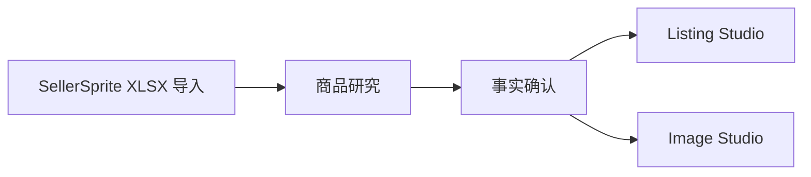

# 轻选工作台

AI 跨境商品研究与创作工作台。

面向跨境电商卖家，提供从商品数据导入、AI 研究、事实确认到 Listing 与图片创作的一条龙工作流。关键决策始终由人工确认。

## Features

- **SellerSprite 商品数据导入** — 上传 SellerSprite XLSX，自动解析商品资料、市场信号与卖点，生成可确认的商品事实候选
- **AI 商品研究** — 对单个商品执行来源、风险、总结与 Listing 维度的研究分析
- **商品事实确认** — 人工确认哪些研究事实可用于创作，未确认内容不进入权威创作输入
- **AI Listing 生成** — 基于已确认事实生成 Listing 草稿，附质量校验与降级兜底
- **AI 图片创作** — 基于共享商品事实与已批准视觉参考生成图片草稿
- **Human-in-the-loop 工作流** — 研究决定、事实确认、Listing 与图片复核均由人工完成
- **数据隔离与安全机制** — 访客沙箱隔离、外部图片安全下载、市场信号与创作事实隔离

## Overview

跨境商品研究依赖大量分散数据（报表、市场信号、产品资料），人工整理耗时且容易出错。轻选工作台把「数据整理 → 事实确认 → AI 辅助生成」组织成一条可控流程：机器处理数据与草稿，人在关键节点做决定。

系统不会自动采购、上架或投放广告。

## Workflow



- **SellerSprite 导入**：解析 XLSX，提取商品资料与市场信号
- **商品研究**：AI 生成来源 / 风险 / 总结 / Listing 四层分析
- **事实确认**：人工勾选可进入创作的已确认事实
- **Listing Studio**：基于确认事实生成 Listing 草稿
- **Image Studio**：基于共享事实与批准参考图生成图片草稿

## Architecture

- **Frontend** — Next.js 应用，工作台 / Listing Studio / Image Studio 等页面
- **Backend** — Next.js API Routes，业务逻辑与 AI 编排
- **Database** — Prisma + SQLite，存储候选、研究记录与创作产物
- **AI Provider** — 可插拔：文本（Listing/研究）与图片（创作）独立配置，支持 Mock 模式
- **Storage** — 本地文件存储，承载图片草稿与导入数据

## Tech Stack

- Next.js 16
- React 19
- TypeScript
- Prisma 5 + SQLite
- OpenAI-compatible AI Provider（可替换）

## Screenshots

> 截图占位：可在 `docs/screenshots/` 下放置主要页面截图。

## Installation

### 环境要求

- Node.js ≥ 20.9
- npm

### 安装

```bash
npm install
npx prisma generate
npx prisma db push
```

### 启动

```bash
npm run dev
```

打开 http://localhost:3000 进入登录页。

## Configuration

复制 `.env.example` 为 `.env.local` 并填写：

| 变量 | 说明 |
| --- | --- |
| `ACCESS_PASSWORD` | 登录访问密码 |
| `AI_PROVIDER` | 文本 AI Provider（`deepseek` 等） |
| `DEEPSEEK_API_KEY` | DeepSeek API 密钥 |
| `LISTING_PROVIDER_MODE` / `IMAGE_PROVIDER_MODE` | `mock` 或 `real`（默认 mock，不调用真实付费 API） |
| `OPENAI_API_KEY` / `OPENAI_IMAGE_MODEL` | 图片 Provider 配置（使用真实图片生成时） |
| `DATABASE_URL` | SQLite 数据库路径 |

更多说明见 [docs/guides/configuration.md](docs/guides/configuration.md)。

## Documentation

- [快速开始](docs/getting-started/installation.md)
- [工作流说明](docs/guides/workflow.md)
- [架构总览](docs/architecture/overview.md)
- [AI 工作流](docs/architecture/ai-workflow.md)
- [数据模型](docs/architecture/data-model.md)
- [参与贡献](docs/development/contributing.md)

## Roadmap

- 真实入行数据接入与 V3 业务迭代（计划中）
- 历史功能需求归档见 [docs/archive](docs/archive/)

## License

MIT License。详见 [LICENSE](LICENSE)。

## Contributing

请阅读 [CONTRIBUTING.md](CONTRIBUTING.md) 与 [docs/development/contributing.md](docs/development/contributing.md)。
