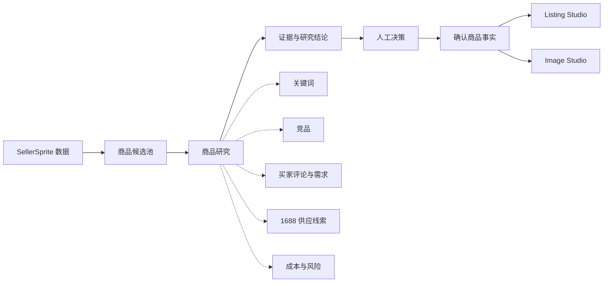

# 轻选工作台

> AI 跨境商品研究与上架准备工作台：把真实数据、证据引用、人工决策和内容生成组织成一条可复核的商品研究流程。

轻选工作台面向跨境电商新手和小团队。它不是“输入商品标题就自动写文案”的工具，而是先整理 SellerSprite、Amazon、买家评论、竞品和 1688 供应线索，再由人工确认商品事实，最后生成可审核的 Listing 与图片草稿。


## 核心流程



1. 导入 SellerSprite 报表，形成候选商品池。
2. 围绕关键词、竞品、买家评论、Amazon 页面和 1688 供应线索采集资料。
3. 将研究结果整理为“市场机会、买家需求与差评、货源与商品匹配、成本与风险”四个业务模块。
4. 由人决定继续、补资料或停止，并确认哪些内容可以成为当前商品事实。
5. Listing Studio 只使用已确认商品事实作为硬属性依据；研究资料只用于定位和表达参考。
6. Image Studio 基于已确认事实和已批准视觉参考生成图片草稿，最终仍由人工审核。

## 当前能力

### 商品研究

- **SellerSprite 导入**：解析 XLSX/CSV 报表，建立商品候选与关键词资料。
- **关键词研究**：保存关键词证据，自动形成可追溯的主词、辅助词和后台搜索词方案。
- **竞品研究**：根据真实关键词发现 Amazon 竞品，并可采集竞品详情页五点作为参考资料。
- **买家评论与需求**：分析 VOC、购买原因、常见痛点、使用场景和观点冲突；历史英文分析会诚实降级，不伪装成中文结论。
- **1688 供应线索**：支持关键词找货、图片找货和链接读取；搜索结果必须预览并由人工确认后才保存。
- **成本与风险**：记录采购价、MOQ、物流费、平台费、广告费和合规状态；缺失数据保持“尚未取得”，不自动填 0。
- **研究结论**：每条事实性结论保留证据依据；AI 分析和未确认信息与商品事实严格分开。

### Listing Studio

- 使用已确认商品事实、研究结论和关键词资料生成标题、五点、描述与搜索词。
- Runtime Skill 统一约束五点数量、句子长度、事实锚点、品牌去重、关键词去重和描述完整性。
- Claim Evidence 门禁阻止未确认性能、时长、认证、绝对承诺和竞品属性进入当前商品 Listing。
- AI 或安全兜底未达到质量标准时显示“暂无合格草稿”和拒绝原因，不把事实碎片冒充正式 Listing。
- 页面展示生成时实际使用的确认事实、关键词、研究参考和待人工确认表达。

### 人工与安全边界

- AI 只能提供研究辅助和草稿，不能自动改变商品状态或替代人工决定。
- 评论观点、竞品属性和供应商声明不能自动成为当前商品事实。
- Owner 正式数据与 Visitor 演示沙箱隔离；保存操作保留版本冲突保护。
- 自动采集仅限本机 Owner 环境；验证码、登录墙、身份错配或来源异常均失败关闭。
- 系统不会自动选品、采购、上架、投放广告，也不承诺销量或利润。

## 两种运行体验

| 模式 | 用途 | 行为 |
| --- | --- | --- |
| `local_owner` | 本机完整工作台 | 显式启用后为本机 Owner 免密模式，可使用研究、确认和创作能力 |
| `public_showcase` | HR/访客只读演示 | 仅展示首页与完整脱敏商品案例，不实时采集、不写正式数据、不消耗访客额度 |

公开演示使用自托管商品图片和脱敏业务快照。仓库推送只更新源代码，**不会自动部署公网服务器**。

## 技术架构

- **前端**：Next.js 16、React 19、TypeScript
- **后端**：Next.js Route Handlers 与服务端业务模块
- **数据**：Prisma 5 + SQLite
- **工作流**：LangGraph 单一有状态研究流程（保留人工中断点）
- **AI Provider**：文本与图片 Provider 分开配置，默认 Mock，真实调用受服务端开关与配额门禁控制
- **采集工具**：SellerSprite 导入、Amazon Browser Use 采集器、本地 1688 CLI/浏览器助手

## 本地运行

### 环境要求

- Node.js 20.9 或更高版本
- npm

### 安装

```bash
npm install
npx prisma generate
npx prisma db push
```

复制 `.env.example` 为 `.env.local`。本机 Owner 免密运行至少设置：

```dotenv
QX_RUNTIME_MODE=local_owner
DATABASE_URL="file:./dev.db"
LISTING_PROVIDER_MODE=mock
IMAGE_PROVIDER_MODE=mock
```

Mock 模式不会调用真实付费 Provider。需要真实 AI 时，再配置对应密钥和服务端开关；不要把 `.env.local`、Token、Cookie 或真实数据库提交到仓库。

### 启动

```bash
npm run check:local
npm run start:local
```

打开 <http://localhost:3005>。开发模式可使用 `npm run dev:local`。

> 请使用带 SQLite 门禁的 `*:local` 命令管理本机 3005，不要用普通 `next start` 替代。

## 验证

```bash
npm test
npm run lint
npx tsc --noEmit
npm run build
```

测试默认不调用真实 AI Provider，也不应写入正式业务数据库。涉及存储或浏览器流程的验收使用隔离数据库、独立数据目录和独立端口。

## 目录结构

| 目录 | 说明 |
| --- | --- |
| `app/` | 页面与 API Route Handlers |
| `components/` | 工作台、研究资料、Listing 与图片界面 |
| `lib/` | 业务逻辑、事实门禁、权限和数据投影 |
| `tools/` | SellerSprite、Amazon、1688 等采集工具 |
| `prisma/` | Prisma Schema；真实数据库不进入提交 |
| `scripts/` | 本地运行、数据库保护和部署辅助脚本 |
| `docs/v4.1/` | V4.1 实施、验证、风险和验收记录 |

## 关键文档

- [V4.1 正式工作台进度](docs/v4.1/FORMAL_V2_PROGRESS.md)
- [研究结论与 Listing 依据收口](docs/v4.1/RESEARCH_LISTING_CLOSURE_R5_PROGRESS.md)
- [Listing Runtime Skill 质量与事实安全](docs/v4.1/LISTING_RUNTIME_REGRESSION_PROGRESS.md)
- [VOC 买家评论研究区收口](docs/v4.1/VOC_REVIEW_CLOSURE_PROGRESS.md)
- [认证、权限与配额契约](docs/architecture/auth-and-quota-contract.md)
- [本地安装说明](docs/getting-started/installation.md)
- [部署手册](docs/deployment/production-runbook.md)
- [版本记录](CHANGELOG.md)

## 项目状态

- **当前产品线**：V4.1 商品研究工作台。
- **当前主链**：候选商品 → 商品研究与证据 → 研究结论 → 人工决策 → 确认商品事实 → Listing / Image。
- **当前边界**：本机 Owner 完整工作台；公网仅作为只读 HR 演示，不通过 Git 推送自动部署。
- **历史版本**：V1/V2/V3/V4.0 的提交与标签保留用于追溯，不再作为当前产品说明。

## Security

本项目涉及 AI Provider 密钥、访问认证、文件上传、浏览器采集和用户数据隔离。请阅读 [SECURITY.md](SECURITY.md)。发现安全问题时请勿在公开 Issue 中粘贴密钥、Token、Cookie、数据库内容或用户资料。

## License

MIT License，详见 [LICENSE](LICENSE)。
