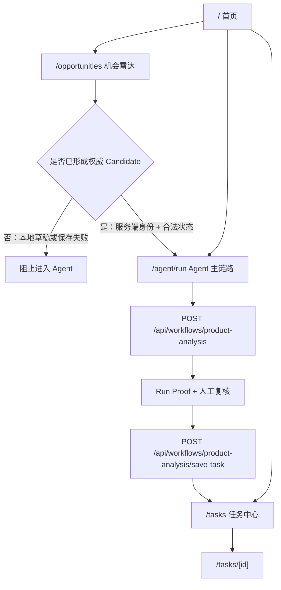

# 当前生产架构

> Production baseline Commit：`2d4562aea234543ef3862b0d10a07e0ac40039b0`（短哈希 `2d4562a`）
> Production baseline Tree：`f1b4d9bebc51ddca01bd70ab615e02fe90833aa0`
> 审计日期：2026-07-23
> 事实来源：已 fetch 的 `origin/main`；只以该引用中的代码、配置、测试和文档为生产事实。
> 排除范围：其他分支的 dirty、未跟踪文件和 Provider 工具均为 `IN-FLIGHT / LOCAL / NOT_PRODUCTION`，不进入生产架构图。
> 复核要求：生产 Commit 或 Tree 变化后，本文件全部事实与统计必须重新扫描，不得增量猜测。

## 1. 状态词

|状态|本文件中的含义|
|-|-|
|`PRODUCTION`|存在于生产 main，且由当前用户路径、运行或运维合同使用。|
|`IN-FLIGHT`|只存在于其他本地分支或未提交工作树。|
|`COMPATIBILITY`|存在于生产 main，目的是承接旧入口或旧产品路径。|
|`EXPERIMENTAL`|存在于生产 main，但明确为 Alpha、诊断或开发专用。|
|`ARCHIVED`|生产 main 明确声明停止维护或已被替代。|
|`UNKNOWN`|生产 main 中存在，但静态证据不足以确认当前消费者或生命周期。|

## 2. 产品定位

生产版本是面向跨境电商选品的受控决策工作台。它把候选、来源证据、Agent 分析、人工复核和 Task 沉淀组合起来，但并不保证每次分析都从 Candidate 开始，也不把 AI 结论当作最终商业判断。

生产 main 已包含：

- 机会分析与 Candidate 池；
- 已认证场景下的 Owner Prisma Candidate，以及 Visitor Sandbox Candidate；
- 来源导入、Evidence 清洗、来源完整性和人工确认；
- `/agent/run` 的单品分析、Run Proof、人工复核与 Task 保存；
- `/tasks`、`/tasks/[id]` 的任务复盘、生命周期、Listing Pack 和图片草稿；
- `/opportunities/import` 的高级手工导入与冻结 Family Top 5 只读审阅；
- Owner 正式数据和 Visitor Sandbox 数据的隔离。

生产 main 不包含：

- `tools/` 或实时 Provider 预筛生成器；
- 自动采购、自动上架、自动投放、自动联系供应商或操作第三方平台账号；
- 无人工确认的 Candidate → Task 转换；
- 把本地草稿、URL 参数或浏览器缓存当作服务端权威 Candidate；
- 把开发分支的 Provider 工具当作当前生产代码。

## 3. 真实入口拓扑

生产导航不是一条强制的 `/ → /opportunities → /agent/run → /tasks` 直线。首页和侧边栏均直接提供三个入口。



### 3.1 `/opportunities` 的 Candidate 事实

`/opportunities` 默认渲染 `OpportunitiesForm` 的 `legacy_default` surface。它会分析输入并先把结果合并进浏览器 Candidate 池，但权威性取决于后续服务端保存：

1. 页面调用 `POST /api/opportunities` 得到分析结果。
2. 结果立即合并成本地 pool item；本地 ID 以 `opp-` 开头，身份是 `local_draft`。
3. 只有已认证且 Candidate API 可用时，页面才调用 `POST /api/opportunity-candidates` 并重新读取服务端 Candidate。
4. 本地草稿可以通过 `/api/opportunity-candidates/import-local` 显式转成服务端 Candidate。
5. 进入 Agent 必须同时满足：服务端可用、`identitySource=server`、ID 不是本地 `opp-`、状态为 `worth_analyzing` 或 `analyzed`、尚未关联 Task，并通过现有市场门禁。

因此，`/opportunities` 可以创建并传递权威 Candidate，但不是无条件创建；未认证、服务端失败或仅本地保存时不会形成可进入 Agent 的权威对象。

### 3.2 `/agent/run` 有两种生产输入

Candidate 路径：

```text
/opportunities
→ 服务端权威 Candidate
→ 人工选择为待分析
→ /agent/run?candidateId=...
→ workflow API 重新读取服务端 Candidate
→ Run Proof
→ 人工复核
→ Candidate → Task 原子转换
```

人工路径：

```text
/agent/run
→ 用户直接输入商品
→ workflow API 按 manual source 运行
→ Run Proof
→ 人工复核
→ 直接创建 Task，不回链 Candidate
```

`candidateId` 存在时，服务端不会信任页面带入的名称和 Evidence，而会重新读取当前身份下的 Candidate、状态、R2.2 门禁和上下文。没有 `candidateId` 时，生产 API 明确允许人工输入路径。

### 3.3 `/opportunities/import` 的真实角色

`/opportunities/import`：

- 存在于 production main，未被 development 条件包围，也不是 redirect；
- 页面元数据和 surface 都明确为“高级手工导入”；
- 生产源码中没有任何静态 href 指向它；只能通过直接 URL 或仓外入口访问；
- readiness 为 `ready` 时展示 `FamilyTop5Review`，并继续展示高级导入表单；
- Artifact 缺失或校验失败时显示警告，仍保留手工导入表单；
- 确认来源导入时仍必须连接服务端 Candidate API，不能直接把只读 Family 数据变成 Task。

结论：它是 `PRODUCTION / ADVANCED_HIDDEN`，不是主导航入口、不是兼容 redirect，也没有代码证据表明它是 development-only。

### 3.4 `/workflow`

`app/workflow/page.tsx` 不再渲染 `WorkflowClient`。它保留已知 query 参数，将旧的 `candidate_to_workflow` entry 改为 `candidate_to_agent_run`，再调用 Next `redirect()` 到 `/agent/run`。静态代码证明 redirect 行为；本轮没有启动运行时，因此不把具体 HTTP 状态码写成已实测事实。

## 4. 页面、组件、API 与数据

|入口|页面/组件|主要 API|生产事实|
|-|-|-|-|
|`/`|`HomeDashboardClient`|`/api/tasks`|读取 Task 摘要；不读取 Candidate API。|
|`/opportunities`|`OpportunitiesForm`|opportunities、source-import、opportunity-candidates、tasks|本地草稿与服务端 Candidate 双层池。|
|`/opportunities/import`|`FamilyTop5Review` + `OpportunitiesForm`|同一 Candidate/来源导入 API|高级隐藏入口；Family 数据只读。|
|`/agent/run`|`AgentRunClient`|product-analysis、save-task|支持 Candidate 和 manual 两种输入。|
|`/tasks`|`TaskRecordsList`|tasks|列表、状态、聚合展示。|
|`/tasks/[id]`|`TaskRecordDetail`|task、lifecycle、listing-pack、image-draft|任务详情与后续资产。|

## 5. Candidate、Evidence、Agent、Task

### Candidate 与 Evidence

- Owner Candidate：Prisma `OpportunityCandidate`。
- Visitor Candidate：按 `demoAccessId` 隔离的 Sandbox Candidate。
- 浏览器本地草稿：非权威对象，只供降级展示和后续显式导入。
- `sourceMetaJson`、Evidence snapshot、source proof 和 source integrity 记录来源合同；“已验证来源链”不等于商品、市场或价格事实已验证。
- Agent 链接中的名称、URL 和 Evidence 是显示/传递材料，服务端 Candidate 才是 Candidate 路径的权威来源。

### Agent 与 Run Proof

- `AgentRunClient` 管理用户输入、缓存恢复、逐步展示、人工确认与保存。
- `app/api/workflows/product-analysis/route.ts` 认证请求、确定 manual/opportunity source，并在 Candidate 路径重新读取权威对象。
- `lib/workflows/productAnalysis.ts` 组合分析步骤。
- 服务器签发 Run Proof；save-task 会重新核对 proof、Candidate、上下文、状态和人工复核。

### Task 与存储

- 通用 Task 仍存放在历史命名的 Prisma `ViralAnalysisRecord`。
- Owner Candidate → Task：在一个 Prisma transaction 中创建 Task，并条件更新 Candidate 的 `convertedTaskId`。
- Visitor Candidate → Task：`createSandboxTaskAndLinkCandidate` 在同一 Sandbox 写入中完成创建和回链。
- manual Agent 保存：Owner 直接创建 `ViralAnalysisRecord`；Visitor 直接创建 Sandbox Task，不发生 Candidate 回链。

## 6. Family Top 5 Artifact 闭包

生产入口为 `lib/upstream/family-top5-adapter.ts`，冻结文件位于 `lib/upstream/fixtures/`。

本次针对 `origin/main` Git blob 重新计算：

- Manifest schema：`family-top5-review-manifest.v2`；
- sourceArtifactId：`2026-07-21-Provider-Aware-Family-Top5-Review-07`；
- Manifest SHA-256 与旁车匹配；
- 3 个 Artifact 的 SHA-256、旁车和 bytes 全部匹配；
- Artifact 分别为 Family 数据、Provenance 和人工审阅 schema；
- Loader 还验证固定 Manifest Hash、schema、Expected Provenance、内部 Hash 绑定和数据数量关系。

这些事实只证明 production main 中冻结闭包自洽，不证明上游 Provider 仍实时可用，也不证明市场效果。

## 7. Prisma 与 Visitor Sandbox

|模式|身份|数据源|Candidate → Task|
|-|-|-|-|
|Owner|正式访问主体|Prisma 5.22 + SQLite|Prisma transaction|
|Visitor|`demoAccessId`|隔离 JSON Sandbox|Sandbox 原子创建与回链|
|未认证/服务端降级|无服务端权威身份|浏览器 localStorage 草稿|禁止进入 Candidate Agent 链|

Prisma schema 的三个模型是 `ListingCopyHistory`、`ViralAnalysisRecord`、`OpportunityCandidate`。本轮只读取 schema，没有读取数据库内容。

## 8. 运行、测试与部署

|层|生产 main 事实|
|-|-|
|Web|Next.js `^15.1.0`、React `^19.0.0`、App Router、TypeScript strict|
|样式|`app/globals.css`、组件 class 与局部样式；无 Tailwind 依赖|
|状态|React state/effect、专用 hooks、session/localStorage；无第三方全局状态库|
|测试|Vitest `^4.1.9`，Node environment；默认只包含 `**/*.test.ts`|
|真实 AI smoke|由 `vitest.real-ai-smoke.config.ts` 单独指向 `scripts/real-ai-listing-smoke.ts`；不属于默认 `npm test`|
|部署|`deploy/ecosystem.config.cjs`、Nginx 示例、systemd 示例、Next server 3005、SQLite pre/post deploy 保护|

生产行为限制：

- `/api/ai/diagnostics` 与 `/api/ai/ping` 在 production 条件下返回 404；
- `/api/radar/*` 四个 Route 在 production 条件下返回 404，并额外限制本地请求；
- `/opportunities` 的视觉 Fixture 只在 development 条件和专用开关同时满足时启用；
- production main 没有 `tools/` 目录。

## 9. 系统分层

|层|职责|位置|
|-|-|-|
|Frontend|入口、表单、降级状态、人工复核、恢复与展示|`app/**/page.tsx`、`components/`、`hooks/`|
|Backend|认证、输入验证、错误合同、存储分流和事务|`app/api/`、`lib/server/`|
|Domain|Candidate、Evidence、决策、利润、风险、Task、Agent 输出|`lib/`、`lib/workflows/`、`lib/tasks/`|
|Artifact Consumer|冻结 Artifact、Manifest、Sidecar、Provenance 校验|`lib/upstream/`|
|Testing|API、领域、权限、恢复、Artifact 回归|共置 `*.test.ts`、`tests/helpers/`|
|Deployment|PM2、Nginx、systemd 示例和 SQLite 保护|`deploy/`、`scripts/db/`、`DEPLOY.md`|
|Documentation|当前事实、运行手册和历史 Phase 记录|`docs/`、`README.md`|

## 10. 本地在途状态

其他开发分支的 16 项 dirty/未跟踪内容以及 Provider compatibility 工具统一为：

```text
IN-FLIGHT / LOCAL / NOT_PRODUCTION
```

它们不参与本文件的生产路由、代码、Artifact 或生命周期统计。是否合入生产必须通过独立审查和发布流程证明。
