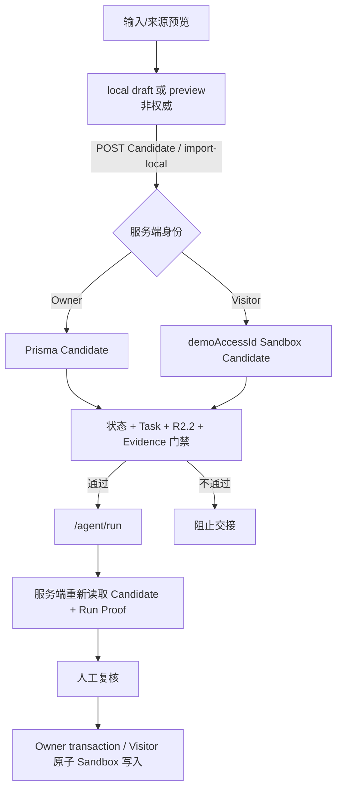

# OpportunitiesForm 深度架构审计

> Source baseline：`origin/main` commit `bb1f9b53c5a5954408cfa9cafeec47807147d1ee`，tree `980572fee37b9563218a644d3eeb6695eda5b553`
>
> 审计日期：2026-07-23
>
> 事实边界：生产事实只来自上述 main。本文另设 `IN-FLIGHT` 小节描述 Phase 2B 治理候选，不把它写成已发布能力。其他工作树的 dirty、未跟踪 Provider 工具、生产数据库和运行时环境均未纳入。
>
> 复核要求：`origin/main` 变化后重新计算全部数量、引用和数据流。Source baseline 不等于生产服务器当前运行版本。

## 1. 当前结构

### 生产 main

|指标|数量|说明|
|-|-:|-|
|物理行数|2,159|`components/cross-border/OpportunitiesForm.tsx`；Phase 1A 至 1E 和 Phase 2A 已合入|
|`useState`|29|无 `useReducer`|
|`useEffect`|5|恢复、Candidate hydration、持久化、Task link、portal 定位|
|`useCallback`|11|请求编排、导出、状态、删除和来源导入|
|`useMemo`|6|默认选择、本地草稿数、筛选、统计、决策摘要、当前选中项|
|`useRef`|2|textarea 和单次草稿恢复标记|
|直接 `fetch`|9|GET 2、POST 5、PATCH 1、DELETE 1|
|直接 localStorage 数据域|2|输入草稿、Candidate 浏览器池|
|间接 sessionStorage 活动 key|5|密码/到期、token、mode、Visitor access，由 access adapter 管理|

生产文件同时承担公开 surface、访问态接入、手工分析、来源预览、Candidate 保存与更新、Task 关联、Agent 交接、localStorage 恢复、portal 菜单和大部分页面 JSX。它是一个浅接口但过宽实现职责的容器，而不是单纯表单。

生产 main 已包含 `lib/opportunityCandidateActions.ts` 的删除 presentation 纯规则，以及 `OpportunitiesLockedPreview`、`OpportunitiesDecisionSummary`、`OpportunitiesFlowGuidance`、`OpportunitiesSourceAvailability`、`OpportunitiesCandidatePoolEmptyState` 五个展示叶子。生产容器仍承担公开 surface、访问态接入、手工分析、来源预览、Candidate 保存与更新、Task 关联、Agent 交接、localStorage 恢复、portal 菜单和大部分页面 JSX。

### Phase 1A（PRODUCTION）

未解锁功能预览 JSX 已移到 171 行的 `OpportunitiesLockedPreview.tsx`。`!unlocked` 条件、surface 文案派生、29 个 state、5 个 effect、11 个 callback、6 个 memo、9 个 fetch、2 个直接 localStorage 数据域、公开 props、渲染 DOM 与数据流均未变化。

### Phase 1B（PRODUCTION）

候选品池五项决策摘要 JSX 已移到 26 行的 `OpportunitiesDecisionSummary.tsx`，生产容器为 2,198 行。`buildDecisionDeskSummary(poolItems)`、memo、29 个 state、5 个 effect、11 个 callback、6 个 memo、2 个 ref、9 个 fetch、2 个直接 localStorage 数据域、公开 props、条件顺序、DOM 与数据流均未变化。

### Phase 1C（PRODUCTION）

主链路引导 JSX 已移到 16 行的 `OpportunitiesFlowGuidance.tsx`，生产容器为 2,190 行。新叶子无 props，保留原文案和 `/agent/run`、`/tasks` href；29 个 state、5 个 effect、11 个 callback、6 个 memo、2 个 ref、9 个 fetch、2 个直接 localStorage 数据域、公开 props、条件顺序、DOM 与数据流均未变化。

### Phase 1D（PRODUCTION）

来源可用性说明 JSX 已移到 29 行的 `OpportunitiesSourceAvailability.tsx`，容器变为 2,169 行。新叶子无 props、callback 或 Hook；浏览器原生 `<details>/<summary>` 仍拥有展开状态，四级来源顺序、文本、class 和 key 保持不变。规范化 JSX SHA-256 前后均为 `4b064e0dda4b86415ab577020aee94acc20c7e3cd05a40263533137929f7de14`。29 个 state、5 个 effect、11 个 callback、6 个 memo、2 个 ref、9 个 fetch、2 个直接 localStorage 数据域、公开 props、API、Storage、权限和数据权威性均未变化。

### Phase 1E（PRODUCTION）

两类 Candidate pool 空状态 JSX 已移到 17 行的 `OpportunitiesCandidatePoolEmptyState.tsx`，容器变为 2,167 行。父组件保留 `poolItems`、`visiblePoolItems`、筛选 state、三态优先级和正常 Candidate 列表，仅同步派生 `pool_empty`、`filter_empty`、`has_results`。叶子只接收一个只读空态，不接收 Candidate 数组、权限、setter 或 callback；无 Hook 或 I/O。规范化三态展示合同 SHA-256 前后均为 `dd1c6c47f429e5f85160dcbef8cc9cba0a2bfd310633179ab2d80f6bb15ebea7`。

29 个 state、5 个 effect、11 个 callback、6 个 memo、2 个 ref、9 个 fetch、2 个直接 localStorage 数据域、5 个间接 sessionStorage 活动 key、公开 props、正常列表、API、Storage、权限和数据权威性均未变化。该叶子为 `PRODUCTION / ACTIVE`。

### Phase 2A（PRODUCTION）

`poolItems` 的六字段计数已从父组件内联实现移到现有 Candidate pool 领域模块的纯 selector `buildCandidatePoolCounts`。输入为只读 `OpportunityCandidatePoolItem[]`，输出为 `all`、`pending`、`worth_analyzing`、`analyzed`、`paused`、`rejected`；父组件保留原 `useMemo`、`[poolItems]` 依赖和全部消费者。

提取后生产容器为 2,159 行。29 个 state、5 个 effect、11 个 callback、6 个 memo、2 个 ref、9 个 fetch、2 个直接 localStorage 数据域、5 个间接 sessionStorage 活动 key 均未变化。已转换 Task 的 `analyzed` Candidate 仍只进入 `all`；绕过正常化的未知状态仍只进入 `all`。服务端未知状态固定回落到 `pending`；Storage 未知状态回落到既有 score/risk 默认状态，可能为 `pending`、`worth_analyzing` 或 `paused`。

### Phase 2B 治理候选（IN-FLIGHT）

候选把父组件 `visiblePoolItems` memo 内的 `filterCandidatePool` 后接 `sortCandidatePool` 组合提取为同一 Candidate pool 领域 module 的 `buildVisibleCandidatePoolItems`。interface 只接收只读 Candidate 数组、现有 `poolFilter` 和现有 `poolSort`，返回有序只读 Candidate 数组。父组件保留原 memo 位置、`[poolItems, poolFilter, poolSort]` 依赖和全部消费者。

候选容器为 2,158 行。29 个 state、5 个 effect、11 个 callback、6 个 memo、2 个 ref、9 个 fetch、2 个直接 localStorage 数据域和 5 个间接 sessionStorage 活动 key 均未变化。selector 仍先 filter 后 sort；`updated` 依次按 `updatedAt` 降序、`score` 降序、中文名称升序比较，`score` 依次按 `score` 降序、`updatedAt` 降序、中文名称升序比较。完全相等时保留当前 JavaScript 稳定排序的输入顺序；缺失或非有限数值沿用原 `||` comparator 的下一字段 fallback。直接未知状态只在 `all` 中出现，已有 `convertedTaskId` 的 `analyzed` Candidate 不进入 `analyzed` filter。Phase 2C 未执行。

## 2. 真实调用方与 interface

公开 props：

```ts
type OpportunitiesFormProps = {
  surface?: "legacy_default" | "advanced_import";
  visualFixture?: OpportunityCandidatePoolItem[];
};
```

|调用方|surface|角色|
|-|-|-|
|`/opportunities`|默认 `legacy_default`|PRODUCTION 主入口；development + 专用开关时可传隔离 fixture|
|`/opportunities/import`|`advanced_import`|PRODUCTION / ADVANCED_HIDDEN；直接 URL 可访问，静态站内 href 为 0，真实访问量 UNKNOWN|

未发现第三种 surface 或第三个生产页面调用方。

## 3. 全部状态分类

分类是主责任，不代表状态没有跨组耦合。

|类别|状态|初始值|生命周期所有者|持久化/权威性|
|-|-|-|-|-|
|A UI|`poolFilter`|`"all"`|容器；筛选控件修改|不持久化；派生视图|
|A UI|`poolSort`|`"updated"`|容器；排序控件修改|不持久化|
|A UI|`selectedPoolCandidateId`|`null`|容器；列表选择修改|不持久化|
|A UI|`showCandidateIntake`|`false`|容器；添加候选按钮修改|不持久化|
|A UI|`expandedIndex`|`null`|容器；分析结果展开修改|不持久化|
|A UI|`sourceImportChecked`|空 `Set`|来源预览选择区|不持久化；不能证明 Candidate 已保存|
|A UI|`openMoreId`|`null`|Candidate 操作菜单|不持久化|
|A UI|`moreMenuStyle`|`display:none`|portal 定位 effect|不持久化|
|B 本地草稿|`rawText`|空字符串|容器；输入和草稿恢复修改|10 分钟 localStorage；非权威|
|B 本地草稿|`candidates`|空数组|手工分析响应|仅内存；分析结果不等于服务端 Candidate|
|B 本地草稿|`sourceImportUrls`|空字符串|来源输入区|仅内存|
|C Candidate|`poolItems`|fixture 或空数组|容器 Candidate pool|浏览器副本与服务端结果混合；每项 authority 必须单独判断|
|C Candidate|`sourceImportCandidates`|空数组|来源预览响应|仅预览，确认前非持久化 Candidate|
|C Candidate|`candidateTaskLinks`|空 Map|Task GET effect|服务端 Snapshot；用于展示和删除/Agent 门禁|
|D 权限/降级|`serverAvailable`|fixture 为 `false`，否则 `null`|Candidate hydration|三态：检测中/服务端可用/本地降级；不是认证本身|
|E 网络请求|`loading`|`false`|手工分析 command|请求进行态|
|E 网络请求|`currentStep`|空字符串|手工分析 command|进度展示|
|E 网络请求|`importingLocal`|`false`|local import command|请求进行态|
|E 网络请求|`sourceImporting`|`false`|来源 preview command|请求进行态|
|E 网络请求|`sourceConfirming`|`false`|来源 confirm command|请求进行态|
|E 网络请求|`taskLinksLoading`|`false`|Task GET effect|请求进行态|
|F 缓存恢复|`poolHydrated`|fixture 布尔值|Candidate hydration effect|阻止恢复前持久化覆盖|
|G 错误/反馈|`error`|空字符串|手工分析 command|本地展示|
|G 错误/反馈|`importResult`|空字符串|local import command|成功/失败提示|
|G 错误/反馈|`poolSyncNotice`|空字符串|Candidate save/status/delete|权威保存和降级提示|
|G 错误/反馈|`sourceImportError`|空字符串|来源 preview/confirm|错误提示|
|G 错误/反馈|`sourceImportWarnings`|空数组|来源 preview response|预览 warning|
|G 错误/反馈|`sourceImportSummary`|`null`|来源 preview response|URL/候选计数展示|
|G 错误/反馈|`sourceConfirmResult`|空字符串|来源 confirm command|保存/refresh 结果提示|

分类合计：A 8、B 3、C 3、D 1、E 6、F 1、G 7，共 29。

### 主要耦合

- `poolItems` 同时驱动 localStorage、筛选、决策台、导入按钮、Task 门禁和 Agent URL。
- `hasAccess + serverAvailable + identitySource + id + status + Task relation + R2.2` 共同决定 Agent 可用性。
- 来源导入有 preview 与 confirm 两套请求态；preview Candidate 不能被误当成服务端 Candidate。
- `poolHydrated` 是恢复顺序门闩；错误移动会让空初始值覆盖缓存。
- `serverAvailable` 同时表达网络探测和 authority 降级，语义比普通 loading 更重。

## 4. Effect 与生命周期

|Effect|依赖|读取/写入|I/O 与 cleanup|竞态与 Strict Mode|
|-|-|-|-|-|
|输入草稿恢复|`draftRestored`, `draftVal`|读取 hook 恢复值，写 `rawText`|无网络；无 cleanup|`didRestore` 保证只恢复一次|
|Candidate hydration|`hasAccess`, `refreshServerPool`, `visualFixture`|写 pool、hydrated、serverAvailable、notice|服务端 GET；失败读 localStorage；cleanup abort|AbortController 阻止卸载后继续；Strict Mode 会重建请求但旧请求被 abort|
|Candidate 本地持久化|`poolHydrated`, `poolItems`, `visualFixtureMode`|写 Candidate localStorage|无 cleanup|hydration 前和 fixture 模式不写|
|Task link 加载|`hasAccess`, `serverAvailable`, `accessPassword`|写 Task Map/loading|GET tasks；cleanup 只设置 cancelled|阻止 stale setState，但不 abort 网络|
|portal 菜单定位|`openMoreId`|查询按钮并写 style|监听 scroll/resize；cleanup 两个 listener|依赖 DOM 位置，当前无真实 DOM 自动化|

## 5. 网络调用

|请求|触发|业务写入|降级/保护|
|-|-|-|-|
|`GET /api/opportunity-candidates?limit=100`|初始加载和 refresh|否|server-first；失败回退浏览器 pool；可 abort|
|`GET /api/tasks?limit=50`|服务端 Candidate 可用|否|失败静默降级；cancelled flag|
|`POST /api/opportunities`|手工分析|可能触发真实 AI/Visitor quota|认证与数量门禁；本任务不调用|
|`POST /api/opportunity-candidates`|分析后保存|Owner Prisma 或 Visitor Sandbox|失败保留本地分析结果并显示 notice|
|`PATCH /api/opportunity-candidates/[id]`|状态修改|是|optimistic update；失败回滚 previous status|
|`DELETE /api/opportunity-candidates/[id]`|确认删除|是|服务端保护已关联 Task；本地草稿只删浏览器|
|`POST /api/opportunities/source-import`|来源 preview|不写 Candidate|生成签名来源预览；签名不可用 fail-closed|
|`POST /api/opportunity-candidates`|确认签名预览|是|重新检查 canSave；成功后 refresh|
|`POST /api/opportunity-candidates/import-local`|显式升级草稿|是|强制 legacy_unverified；Owner/Visitor 分流|

组件没有统一 request id。分析、preview、confirm、PATCH 和 DELETE 主要依赖 disabled/loading 状态减少重复触发；这不是已证明的 stale-response 完整保护。

## 6. Storage 与 URL

|对象|位置|TTL/版本|authority|
|-|-|-|-|
|输入草稿 `qx:opportunities-draft:v1`|localStorage|10 分钟 / v1|非权威|
|Candidate pool `qx:opportunity-candidate-pool:v1`|localStorage|7 天 / v1|非权威；不恢复 Evidence、R2.2、`convertedTaskId`|
|密码/到期|sessionStorage adapter|当前 tab|访问状态，不由表单直接读写|
|token/mode/Visitor access|sessionStorage adapter|当前 tab|访问状态，不由表单直接读写|
|Agent query|`buildCandidateAgentRunHref`|一次导航|交接材料，不是服务端 Candidate authority|

组件不读取 query string，只构建 `/agent/run` URL。

## 7. 权限与权威数据流



- Owner authority：Prisma Candidate 与 Task。
- Visitor authority：匹配 `demoAccessId` 的 Sandbox Candidate 与 Task。
- localStorage、URL 和 preview 均不能覆盖服务端 authority。
- `official_readonly` Visitor Candidate 不能修改、删除或进入 Agent。
- Task Snapshot 或 `convertedTaskId` 任一存在时，Candidate 不得再次进入 Agent，删除也必须被保护。

## 8. UI 职责分区

- surface header、主路径说明和权限/fixture 提示；
- Candidate intake：手工输入、分析、结果、复制与导出；
- source import：URL/RSS/Sitemap preview、warning、选择与确认；
- Candidate pool：筛选、排序、计数、local import；
- decision desk：列表、详情、Evidence、风险、R2.2 与处理状态；
- actions：状态、Agent、Task link、删除和 portal 菜单；
- empty/error/degraded states。

## 9. 审计结论

Phase 1 已正式收口，五个高确定性纯展示叶子覆盖未解锁预览、决策摘要、主链路引导、来源说明和 Candidate pool 空状态。Phase 2A 已把 Candidate pool 计数迁移到纯 selector。Phase 2B 候选只集中现有过滤排序组合；两个 memo 与状态所有权仍在父组件。这不授权后续迁移 state、Effect、API、Storage 或权限逻辑，Phase 2C 尚未执行。
