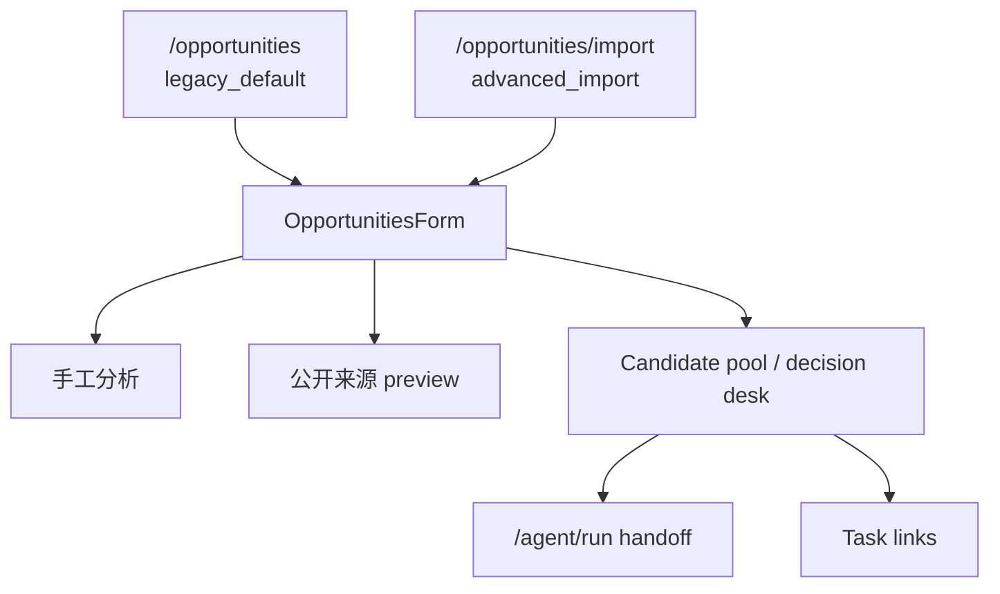

# OpportunitiesForm 系统地图

> Source baseline：`origin/main` commit `00e937d7bbc1bb44a9abe5846a85b3d44a988f97`，tree `f17ee10bbf5448edaa890eff219e6ce8f887f3c6`
>
> 审计日期：2026-07-23。生产事实仅来自上述 main；本文另行标记基于该基线形成的 Phase 1E 候选，其他 dirty 工作树和 Provider 本地工具均为 `IN-FLIGHT / LOCAL / NOT_PRODUCTION`。main 变化后必须重算。

## 1. 定位

`OpportunitiesForm` 是 `/opportunities` 与 `/opportunities/import` 共用的客户端编排容器。它连接浏览器草稿、服务端 Candidate、来源 Evidence、R2.2、Task Snapshot 与 Agent handoff，但不直接写数据库。

详细 state、Effect 和 ownership 见 `OPPORTUNITIES_FORM_AUDIT.md`。

## 2. 入口



- `/opportunities` 是 PRIMARY；development-only 条件可传隔离视觉 fixture。
- `/opportunities/import` 是 PRODUCTION / ADVANCED_HIDDEN；无站内静态 href，真实访问量 UNKNOWN。
- 没有第三个生产调用方或 surface。

## 3. module 与依赖

|层|module/interface|作用|
|-|-|-|
|访问 adapter|`useAccessPassword`、`buildAccessHeaders`、`getAccessMode`|session access，不把前端隐藏当权限|
|草稿 adapter|`useLocalDraft`|10 分钟输入恢复|
|Candidate domain|`opportunityCandidatePool`|normalize、merge、Storage、status、Agent eligibility|
|Action domain|`opportunityCandidateActions`|Candidate 删除 presentation 纯规则；PRODUCTION|
|展示叶子|`OpportunitiesLockedPreview`|Phase 1A 的未解锁纯展示叶子；只接收只读 surface 文案；PRODUCTION / ACTIVE|
|展示叶子|`OpportunitiesDecisionSummary`|Phase 1B 的五项 Candidate 摘要；只接收只读 `DecisionDeskSummary`；PRODUCTION / ACTIVE|
|展示叶子|`OpportunitiesFlowGuidance`|Phase 1C 的主链路引导；无 props，保留原静态文案与 `/agent/run`、`/tasks` 链接；PRODUCTION / ACTIVE|
|展示叶子|`OpportunitiesSourceAvailability`|Phase 1D 的来源等级说明；无 props，保留原四级顺序、文案和浏览器原生 disclosure；PRODUCTION / ACTIVE|
|展示叶子|`OpportunitiesCandidatePoolEmptyState`|Phase 1E 候选的 Candidate pool 空状态；只接收只读三态中的两个空态，不接收 Candidate 数组；合入 main 后为 PRODUCTION / ACTIVE|
|Evidence/R2.2|candidate evidence、quality、decision desk modules|来源、风险和市场门禁展示|
|Task domain|`candidateTaskLinks`|Snapshot 与 canonical Task 关联|
|Agent adapter|`candidateAgentRunLink`|构建受限 `/agent/run` handoff URL|
|Source adapter|`sourceImportCandidateSave`、rule policy|只保存完整签名来源输入|

### Phase 1A 展示所有权

- `OpportunitiesForm` 继续拥有 `!unlocked` 条件、surface 文案派生以及全部 state、Effect、请求、Storage 和权限接入。
- `OpportunitiesLockedPreview` 只把既有未解锁 JSX 渲染为相同 DOM；输入为 `eyebrow`、`lockedTitle`、`lockedDescription` 三个只读字段。
- 新叶子没有 callback、Hook、网络、Storage、权限或数据库访问，也不接收 Candidate、Task 或 Evidence 权威对象。
- 默认与 `advanced_import` 的锁定文案、静态示例、安全说明及 fixture 隐藏状态由公开 interface SSR 测试保护。

### Phase 1B 展示所有权

- `OpportunitiesForm` 继续从 `poolItems` 构建并 memoize `decisionDeskSummary`；Candidate 状态解释仍由 `buildDecisionDeskSummary` 拥有。
- `OpportunitiesDecisionSummary` 只按原顺序渲染“全部候选、待查看、待分析、分析中、已转任务”五个数值。
- interface 只有一个只读 `summary` prop；无 callback、Hook、网络、Storage、权限或数据库访问。
- default 与 `advanced_import` 的已解锁 fixture、空 fixture 以及锁定态由同一公开 interface SSR 测试保护。

### Phase 1C 展示所有权

- `OpportunitiesForm` 继续拥有 `!unlocked` 条件、surface 选择、页头、连接状态以及全部 state、Effect、请求、Storage 和权限接入。
- `OpportunitiesFlowGuidance` 无 props，只返回原主链路说明以及原 `/agent/run`、`/tasks` 声明式链接。
- 新叶子没有 callback、Hook、网络、Storage、权限、数据库或 Candidate/Task 权威对象访问。
- default 与 `advanced_import` 的已解锁态及两个 surface 的锁定态由同一公开 interface SSR 测试保护；锁定态不渲染该引导。

### Phase 1D 展示所有权

- `OpportunitiesForm` 继续拥有 `showCandidateIntake` 条件、来源输入、preview/confirm command 以及全部 state、Effect、请求、Storage 和权限接入。
- `OpportunitiesSourceAvailability` 无 props，只按原顺序渲染 `SOURCE_IMPORT_TIERS` 的四级说明；展开状态仍由浏览器原生 `<details>/<summary>` 拥有。
- 新叶子没有 callback、Hook、网络、Storage、权限、数据库或 Candidate/Task 权威对象访问。
- 默认与 `advanced_import` 的已解锁挂载测试保护初始收起、展开、再次收起、四级顺序及目标交互零新增网络/Storage 写入；锁定 surface 的 SSR 测试保护该说明不出现。

### Phase 1E 展示所有权

- `OpportunitiesForm` 继续拥有 `poolItems`、`visiblePoolItems`、`poolFilter` 和三态优先级；父组件同步派生 `pool_empty`、`filter_empty`、`has_results`。
- `OpportunitiesCandidatePoolEmptyState` 只接收只读空态，不接收 Candidate 数组、权限对象、setter 或业务 callback；正常 Candidate 列表继续留在容器。
- 新叶子没有 Hook、网络、Storage、权限、数据库或 Candidate/Task 写入；两类空状态的原 class 与文案保持不变。
- default 与 `advanced_import` 的真实挂载测试覆盖空池、筛选为空、恢复全部及正常列表顺序；锁定态由公开 interface SSR 测试保护。

## 4. 数据流

### 手工分析

```text
rawText
→ POST /api/opportunities
→ 临时分析结果 + local pool merge
→ POST /api/opportunity-candidates
→ refresh server Candidate
→ authority gate
→ /agent/run
```

分析成功但 Candidate 保存失败时，结果必须保持为本地非权威状态，并显示同步失败。

### 来源导入

```text
URL/RSS/Sitemap
→ POST /api/opportunities/source-import
→ signed preview（不写 Candidate）
→ 人工选择 + canSave
→ POST /api/opportunity-candidates
→ refresh server Candidate
```

### local import

```text
local_draft
→ 显式 POST /api/opportunity-candidates/import-local
→ Owner Prisma 或 Visitor Sandbox Candidate
→ legacy_unverified
→ refresh
```

## 5. authority 优先级

1. 当前认证主体下的服务端 Candidate/Task；
2. 当前服务端响应带回的 Evidence、R2.2、`convertedTaskId`；
3. 浏览器 pool 仅作草稿与降级显示；
4. URL query 仅作 handoff 材料；
5. preview Candidate 未确认前不属于服务端 Candidate。

服务端同一 Candidate 与 local draft 合并时服务端版本优先，未匹配草稿保留。

## 6. Agent gate

必须同时满足：

- 当前服务端池可用；
- `identitySource === "server"` 且不是 `opp-` 本地 ID；
- 状态允许分析；
- 非 `official_readonly`；
- 无 Task Snapshot 和 `convertedTaskId`；
- 满足 R2.2 shortlisted，或 watch 已有明确人工复核。

点击 Agent 前先把 Candidate 状态保存为 `analyzed`；保存失败不跳转。Agent 服务端仍会重新读取 Candidate，不能信任 URL Snapshot。

## 7. 生命周期与恢复

- 草稿由 `didRestore` 只恢复一次；
- Candidate 有访问态时 server-first，失败 fallback localStorage；
- `poolHydrated` 前不写浏览器 pool；
- fixture 不读 access、Storage 或 API；
- Candidate 请求可 abort；Task link 请求只阻止 stale state write；
- portal menu 清理 scroll/resize listener。

## 8. 风险

- 29 个 state 和 9 个 fetch 仍集中在单一容器；
- 非 Effect command 没有统一 request generation；
- 当前 mounted Node 测试覆盖来源 disclosure 和 Candidate pool 三态切换，仍不能替代 portal 或 Strict Mode 时序证据；
- access、authority、网络降级和 UI feedback 通过多个 state 隐式组合。
