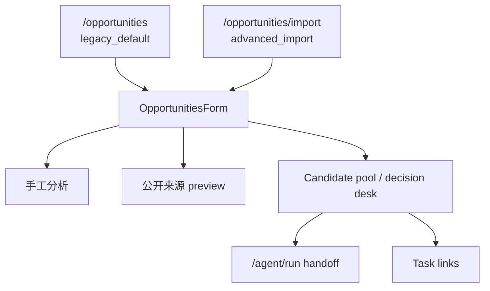

# OpportunitiesForm 系统地图

> Source baseline：`origin/main` commit `e536c8bf9771af1b7d615511fdda8449034d3867`，tree `a6d8eaf991b6c733bbb862996fe0cf7d4c11b693`
>
> 审计日期：2026-07-23。生产事实仅来自上述 main；治理候选、其他 dirty 工作树和 Provider 本地工具均为 `IN-FLIGHT / LOCAL / NOT_PRODUCTION`。main 变化后必须重算。

## 1. 定位

`OpportunitiesForm` 是 `/opportunities` 与 `/opportunities/import` 共用的客户端编排容器。它连接浏览器草稿、服务端 Candidate、来源 Evidence、R2.2、Task Snapshot 与 Agent handoff，但不直接写数据库。

详细 state、Effect 和 ownership 见 `OPPORTUNITIES_FORM_AUDIT.md`。

## 2. 入口



- `/opportunities` 是 PRIMARY；development-only 条件可传隔离视觉 fixture。
- `/opportunities/import` 是 PRODUCTION / ADVANCED_HIDDEN；无站内静态 href，真实访问量 UNKNOWN。
- 没有第三个生产调用方或 surface。

## 3. module 与依赖

|层|module/interface|作用|
|-|-|-|
|访问 adapter|`useAccessPassword`、`buildAccessHeaders`、`getAccessMode`|session access，不把前端隐藏当权限|
|草稿 adapter|`useLocalDraft`|10 分钟输入恢复|
|Candidate domain|`opportunityCandidatePool`|normalize、merge、Storage、status、Agent eligibility|
|Action domain|`opportunityCandidateActions`|治理候选中的删除 presentation 纯规则；未进入 main 前为 IN-FLIGHT|
|Evidence/R2.2|candidate evidence、quality、decision desk modules|来源、风险和市场门禁展示|
|Task domain|`candidateTaskLinks`|Snapshot 与 canonical Task 关联|
|Agent adapter|`candidateAgentRunLink`|构建受限 `/agent/run` handoff URL|
|Source adapter|`sourceImportCandidateSave`、rule policy|只保存完整签名来源输入|

## 4. 数据流

### 手工分析

```text
rawText
→ POST /api/opportunities
→ 临时分析结果 + local pool merge
→ POST /api/opportunity-candidates
→ refresh server Candidate
→ authority gate
→ /agent/run
```

分析成功但 Candidate 保存失败时，结果必须保持为本地非权威状态，并显示同步失败。

### 来源导入

```text
URL/RSS/Sitemap
→ POST /api/opportunities/source-import
→ signed preview（不写 Candidate）
→ 人工选择 + canSave
→ POST /api/opportunity-candidates
→ refresh server Candidate
```

### local import

```text
local_draft
→ 显式 POST /api/opportunity-candidates/import-local
→ Owner Prisma 或 Visitor Sandbox Candidate
→ legacy_unverified
→ refresh
```

## 5. authority 优先级

1. 当前认证主体下的服务端 Candidate/Task；
2. 当前服务端响应带回的 Evidence、R2.2、`convertedTaskId`；
3. 浏览器 pool 仅作草稿与降级显示；
4. URL query 仅作 handoff 材料；
5. preview Candidate 未确认前不属于服务端 Candidate。

服务端同一 Candidate 与 local draft 合并时服务端版本优先，未匹配草稿保留。

## 6. Agent gate

必须同时满足：

- 当前服务端池可用；
- `identitySource === "server"` 且不是 `opp-` 本地 ID；
- 状态允许分析；
- 非 `official_readonly`；
- 无 Task Snapshot 和 `convertedTaskId`；
- 满足 R2.2 shortlisted，或 watch 已有明确人工复核。

点击 Agent 前先把 Candidate 状态保存为 `analyzed`；保存失败不跳转。Agent 服务端仍会重新读取 Candidate，不能信任 URL Snapshot。

## 7. 生命周期与恢复

- 草稿由 `didRestore` 只恢复一次；
- Candidate 有访问态时 server-first，失败 fallback localStorage；
- `poolHydrated` 前不写浏览器 pool；
- fixture 不读 access、Storage 或 API；
- Candidate 请求可 abort；Task link 请求只阻止 stale state write；
- portal menu 清理 scroll/resize listener。

## 8. 风险

- 29 个 state 和 9 个 fetch 集中在单一容器；
- 非 Effect command 没有统一 request generation；
- Node 测试不能证明 portal、真实 DOM 或 Strict Mode 时序；
- access、authority、网络降级和 UI feedback 通过多个 state 隐式组合。

