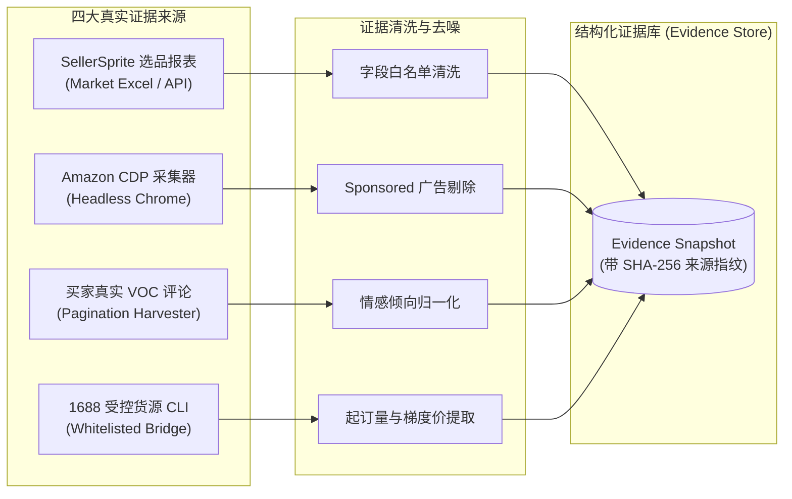

# 证据链治理与事实隔离机制 (Evidence Chain & Fact Authority)

在传统的跨境电商 AI 应用中，模型直接基于简短的提示词或零散的网页抓取即时生成文案。这种“端到端黑盒”模式极易引发严重的事实幻觉——将竞品的功能特征当成本品特征、将买家的主观吐槽当成物理缺陷、凭空臆造认证和材质参数。

轻选工作台构建了一套完整的**证据链治理与事实权威体系（Evidence Chain & Fact Authority System）**，确立了从数据摄取、去噪清洗、人工核验到创作映射的全程可溯源机制。

---

## 1. 核心设计哲学：证据不等于事实（Evidence ≠ Fact）

系统在架构底层严格区分“外部证据（Evidence）”与“商品事实（Fact）”：

```text
  ┌──────────────────────────────────────────────────────────┐
  │                   外部多源证据 (Evidence)                 │
  │  - SellerSprite 报表 (市场体量与流量热词)                  │
  │  - Amazon CDP 页面 (标杆竞品详情与变体结构)               │
  │  - 买家评论 VOC (买家主观痛点、情感倾向与吐槽点)          │
  │  - 1688 货源线索 (供应链报价、MOQ 与起订规格)              │
  └─────────────────────────────┬────────────────────────────┘
                                │
                                ▼ [不可逾越的隔离红线]
  ┌──────────────────────────────────────────────────────────┐
  │                   人工事实门禁 (Human Gate)               │
  │  运营人员逐项比对候选，确认哪些物理规格真正属于当前商品   │
  └─────────────────────────────┬────────────────────────────┘
                                │ (加盖 CAS 版本印章)
                                ▼
  ┌──────────────────────────────────────────────────────────┐
  │              权威核准事实 (Confirmed Facts)               │
  │  - 物理材质、容量规格、尺寸重量、真实隔层结构             │
  │  - 作为受控创作的唯一输入上下文 (Positive-Allow)          │
  └──────────────────────────────────────────────────────────┘
```

### 核心隔离推论：
- **`Evidence ≠ Fact`**：采集到的外部文本只是一份参考证据，绝不自动等同于商品真实规格。
- **`VOC ≠ Fact`**：买家评论中的抱怨（如“盖子容易漏水”）反映的是用户情绪与使用体验，不能直接反推为本商品的物理缺陷或宣称。
- **`AI Summary ≠ Fact`**：大语言模型的归纳与推演仅供运营决策参考，未经过人工确认前严禁直接写进上架 Listing。
- **`Competitor Evidence ≠ Fact`**：标杆竞品的五点卖点属于竞品专属，严禁直接照搬或挪用至本品。
- **`Sourcing Evidence ≠ Fact`**：批发商提供的宣传描述可能存在夸大，必须经过运营核准后方可转化为 Amazon 合规规格。
- **`Keyword Evidence ≠ Fact`**：高频搜索词仅代表消费者的搜索意图与流量靶向，不代表本品必然自带该项功能。

---

## 2. 四大来源证据摄取通道 (Acquisition Pipelines)



### 2.1 Amazon 详情与标杆竞品采集 (Amazon CDP Harvester)
- **环境校准**：通过 Chrome DevTools Protocol 独立 Session 启动，注入美国真实 ZIP 邮区（如 90001）与 USD 货币符号环境，保证获取到的展示价格与运费均为美区买家真实视角；
- **防爬与风控熔断**：遭遇图形验证码（Captcha）、登录墙或异常重定向时，系统立即 Fail-Closed 中断并返回类型化状态，绝不伪造虚假数据；
- **广告过滤**：自动识别页面中带有 `Sponsored` 标记的广告位竞品并予以剔除，确保仅采集真实有机排名的标杆商品。

### 2.2 买家真实评论洞察 (VOC Review Acquisition)
- 分页遍历目标 ASIN 的真实买家评价，按星级（1-2 星差评、4-5 星好评）与购买认证（Verified Purchase）结构化归一；
- 提取痛点场景、故障反馈与正面赞赏词，形成按频率与影响度排序的 VOC 矩阵。

### 2.3 受控 1688 供应链对接 (1688 Sourcing Engine)
- 采用只读命令白名单驱动受控 CLI 桥接，对供应商返回的商品图文、阶梯报价、起订量（MOQ）进行标准化 Schema 映射；
- 访客沙箱环境（Public Showcase）物理阻断外部 CLI 调用，确保商业敏感采购数据绝不外泄。

### 2.4 SellerSprite 报表透视 (Market Opportunity Radar)
- 自动解析类目报表，沉淀月销量、销售额趋势、退货率、BSR 排名及价格分布带，为选品立项提供客观市场参照。

---

## 3. 人工事实裁决门禁 (Human Gate)

从证据到事实的跃迁，必须经过运营人员的显式人工确认（Human-in-the-loop）：

1. **事实候选抽取**：系统从多源证据中自动抽取结构化的候选属性（如：`材质: 304不锈钢`、`容量: 32oz`、`是否含吸管: 是`）；
2. **可视化比对确认**：运营人员在工作台中逐条查看事实候选与证据原文片段，逐项勾选确认；
3. **加盖 CAS 锁保存**：
   - 确认结果提交时，系统执行 `Compare-And-Swap` 版本检查；
   - 确认通过的事实集合打上不可篡改的 `storageVersion` 与时间戳，存入数据库作为“权威核准事实（Confirmed Facts）”；
   - 未被勾选的项自动标记为未确认，后续创作流水线完全对它们不可见。

---

## 4. Positive-Allow 证据溯源门禁 (Claim Evidence)

在 Listing Studio 生成与质检过程中，系统采用严格的 **Positive-Allow（白名单放行）** 准则：

- **逐字溯源校验**：
  标题、五点和长描述中出现的每一条关键事实性主张（Claim），必须在 Confirmed Facts 中找到精准对应；
- **无依据主张拦截**：
  若文案中宣称了未核准的材质等级（如从未证实“医用级316不锈钢”）、未证实的权威认证（如“FDA Approved / BPA Free”）或夸大的性能指标，系统将在代码级直接拦截拒绝放行，并明确标红指示具体违规行；
- **语言完整性校验**：
  对于跨语言（如中文事实渲染为英文 Listing）的场景，确保数字、度量单位（oz, ml, cm, inch）在转换过程中 100% 精确对应，拒绝静默丢失或单位混淆。

---

## 5. 历史快照重判与防退化机制 (Historical Draft Read Guard)

为防止系统随着规则升级而放行旧版本中残留的不合规草稿，系统设计了**历史快照动态重判机制**：

- 当用户打开任何历史保存的 Listing 草稿时，系统不会仅仅根据历史数据库中的 `status: pass` 静态标记放行；
- 运行时在读取快照的同时，立即使用当前最新的 **Copy Quality 语法引擎** 与 **Positive-Allow 门禁** 对历史文案进行全量实时重跑；
- 若历史草稿中存在已被新规则识别出的僵硬病句或未证实 Claim，界面立即将放行状态降级为 `needs_review`，并高亮指出具体瑕疵，确保任何输出物始终符合最高质量标准。
