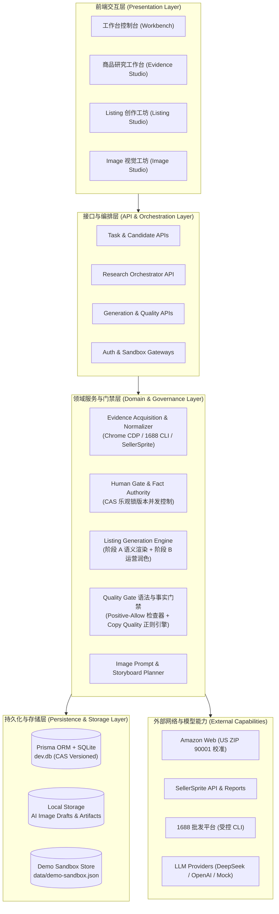
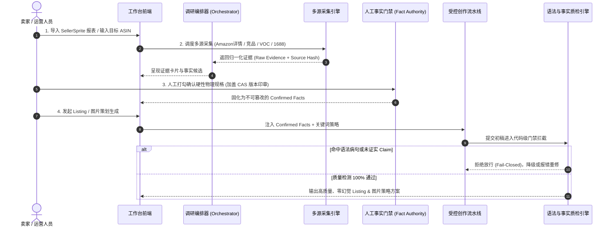

# 系统架构总览 (System Architecture Overview)

轻选工作台是一个面向跨境电商商品深度研究与 Amazon 上架准备的 **证据驱动型 AI 工作台（Evidence-driven AI Workbench）**。系统将外部多源真实采集、证据链清洗治理、人工事实核准与受控内容生成无缝衔接，从底层杜绝 AI 事实幻觉与虚假达标。

---

## 1. 系统分层架构 (Layered Architecture)

系统采用严谨的分层架构设计，确保外部采集、数据清洗、人工裁决与内容生成之间的边界清晰、职责隔离：



---

## 2. 核心数据流主链路 (Core Dataflow)

整个系统围绕商品生命周期的 5 个关键阶段展开流转：



---

## 3. 关键架构原则与工程保障

### 3.1 核心原则：证据不等于事实（Evidence ≠ Fact）
系统底层确立了严格的事实隔离边界：
- **采集到的文本仅作为参考证据**：网页抓取到的段落、竞品描述、供应商宣传均属于外部信号，绝不自动升格为本商品的事实规格。
- **未核准信息物理隔离**：未经人工确认的推论、主观评价或竞品专有特性，物理阻断进入后续 Prompt 或生成上下文。

### 3.2 严格代码级 Positive-Allow 门禁
文案中出现的任何材质、尺寸、容量、结构属性，必须在已核准证据索引中逐字可溯。严禁任何无依据推理、等级虚标或夸大认证（如无依据宣称 FDA/BPA-free）。

### 3.3 正则级 Copy Quality 语法引擎
解决单纯“词数统计放行”带来的假通过问题，在代码层使用确定性正则表达式拦截 5 大类机器容易出现的僵硬英文病句：
1. **动词机制套壳**（`opens through its ... mechanism`）
2. **介词与搭配错误**（`suitable for use at daily hydration`）
3. **场景复读口吃**（`suitable for use at ... desk use`）
4. **主客体逻辑倒置**（`fits cup holder-friendly base`）
5. **单数可数名词无冠词裸奔**（`features MagSlider lid`）

### 3.4 CAS 乐观锁并发版本治理
通过 SQLite 数据模型中的 `storageVersion` 实施 CAS (Compare-And-Swap) 并发控制。当运营人员核准事实或保存文案时，若底层数据已被其他窗口或后台任务更改，操作主动拦截并提示重新载入，杜绝脏写与数据踩踏。

### 3.5 双运行模式与环境隔离 (Dual Runtimes)
- **`local_owner` 模式**：本机完整功能工作台，支持真实 Chrome CDP 采集、1688 CLI 受控调用与主数据库写入。
- **`public_showcase` 模式**：公开演示沙箱，仅对外呈现已脱敏的静态案例与历史快照，物理切断外部命令执行与真实数据库写入。

---

## 4. 模块结构与代码组织

```text
ecommerce-product-ai-optimizer/
├── app/                        # Next.js 16 App Router 前端页面与 API Routes
│   ├── (studios)/              # Listing Studio 与 Image Studio 受控工坊页面
│   ├── opportunities/          # 市场机会发现与类目报表透视
│   ├── tasks/                  # 商品深度研究主控台 (四大证据卡片与事实确认)
│   └── api/                    # 80+ RESTful API 路由 (任务编排、采集、生成、质检)
├── components/                 # 模块化 UI 组件体系 (Tailwind CSS + Radix UI + Lucide)
│   ├── evidence/               # 证据治理、采集卡片与人工确认面板
│   ├── cross-border/           # 竞品分析、买家 VOC 评论分析、1688 供应链面板
│   └── listing-handoff/        # Listing 协同编辑器、文案质量检测仪表板
├── lib/                        # 核心领域与服务端业务逻辑
│   ├── server/                 # 权限契约、CAS 并发锁、Fail-Closed 防护与采集编排
│   ├── listingHandoff/         # 阶段 A 语义渲染、阶段 B 运营润色、Copy Quality 引擎
│   └── imageHandoff/           # 视觉参考匹配、Prompt 拼装与图片元数据
├── tools/                      # 独立采集器实现 (Chrome CDP 采集脚本、SellerSprite 解析器)
├── prisma/                     # 数据模型与迁移定义 (schema.prisma)
└── docs/                       # 系统架构、业务手册与工程规范文档库
```

---

## 5. 相关核心文档导航

- [证据链治理与事实隔离机制 (Evidence Chain)](evidence-chain.md)
- [安全体系与并发控制契约 (Security & Concurrency)](security.md)
- [工程技术决策记录 (Architecture Decision Records)](../decisions/engineering-decisions.md)
- [产品全景与业务场景 (Product Overview)](../product/product-overview.md)
- [本地开发与部署指南 (Local Development)](../development/local-development.md)
