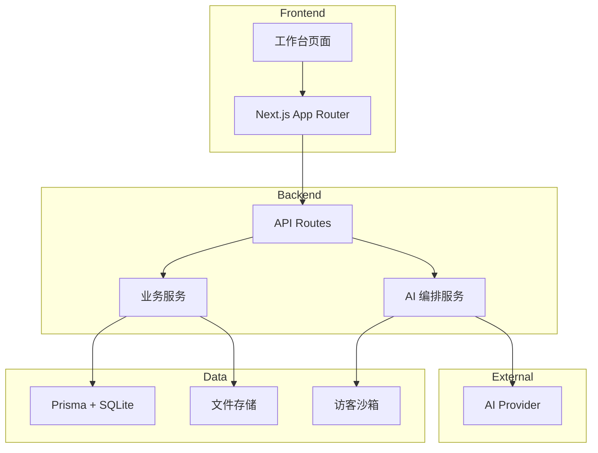

# 架构总览

## 分层

## Frontend

- Next.js App Router，React 19
- 主要入口：工作台、发现商品、Listing Studio、Image Studio
- 客户端只提交服务端允许的字段，不构造权威数据

## Backend

- Next.js API Routes 提供 HTTP 接口
- 业务服务处理候选导入、研究记录、创作交接（Creative Handoff）与持久化
- AI 编排服务调用文本 / 图片 Provider，带质量校验与降级

## Database

- Prisma ORM + SQLite（`dev.db`）
- 核心模型：OpportunityCandidate（候选商品）、ViralAnalysisRecord（研究任务）、ProductBatch 等
- 访客体验数据使用独立文件沙箱（`data/demo-sandbox.json`），与正式库隔离

## Storage

- 本地文件目录承载图片草稿（`AI_IMAGE_DRAFT_STORAGE_ROOT`）
- SellerSprite 导入的 XLSX 即时解析，不留档

## AI Provider

- 文本与图片 Provider 独立配置
- 默认 Mock 模式；切换 `real` 后调用真实 API
- 外部图片下载实施安全链（域名白名单、公网 IP 校验、pinned HTTPS、格式/大小限制、SHA-256 指纹）

## 安全与隔离

- 访客沙箱隔离：访客数据不进入正式库
- 创作事实隔离：市场信号不进入 Image/Listing 创作输入
- 视觉参考安全获取：仅用户明确点击后服务器受控下载单张图片
