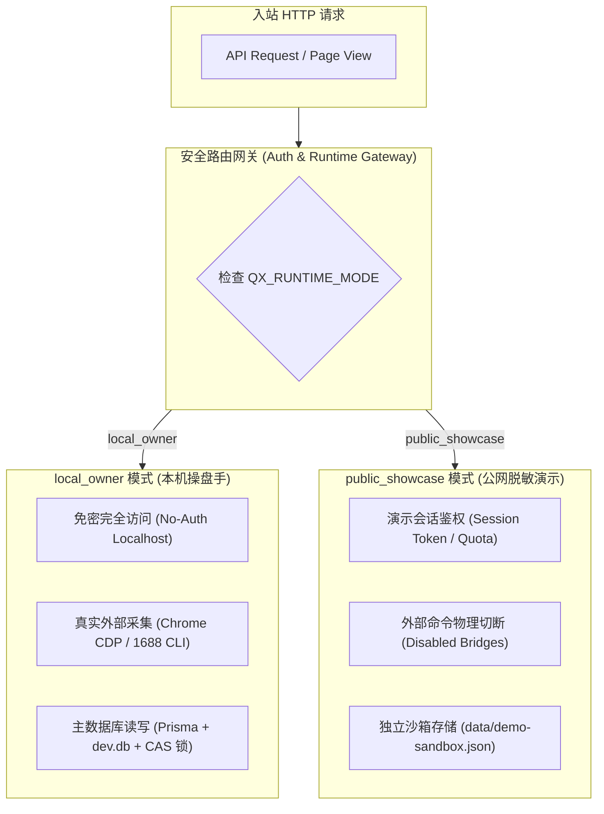
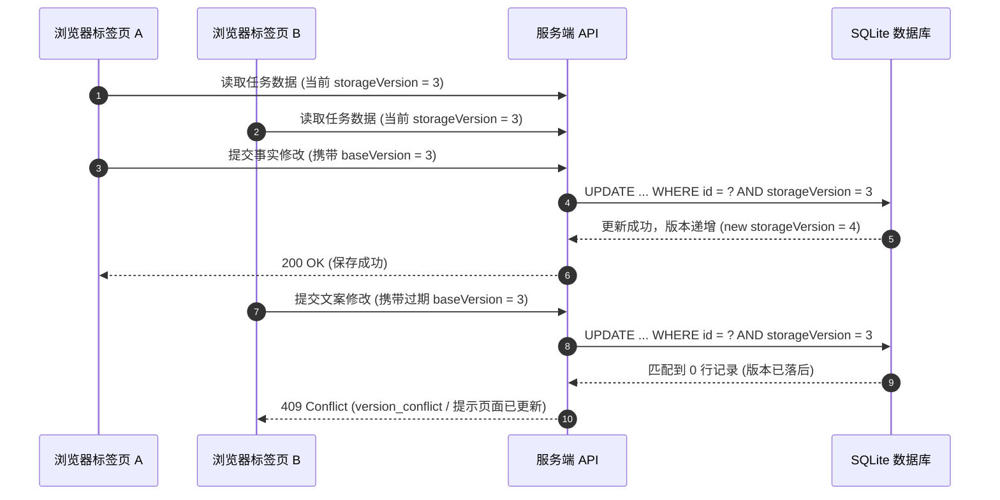

# 安全架构与并发控制契约 (Security Architecture & Concurrency Contract)

轻选工作台在设计上严格遵循企业级安全与数据保护标准，通过双运行模式隔离、CAS 乐观锁版本并发控制、Fail-Closed 防护与严格白名单机制，保障系统在本地作业与公网演示场景下的数据安全与执行边界。

---

## 1. 双运行模式与权限隔离体系 (Dual Runtimes & Access Control)

为了满足既要在本地提供高效免密的运营作业环境，又能在公开环境提供安全只读演示的需求，系统在底层构建了物理级的双运行模式：



### 1.1 `local_owner`（本地操盘模式）
- **适用场景**：操盘手在个人电脑或内网专用服务器上运行完整业务链路；
- **免密访问机制**：系统检测到仅监听本地环回地址（Loopback IP）且环境变量设置为 `local_owner` 时，免除繁琐密码输入，提供流畅的工作台作业流；
- **权限完整性**：允许执行受控 Chrome 自动化采集、1688 批发线索抓取，拥有主数据库（`dev.db`）的完整读写能力；
- **并发保护**：所有持久化写操作均受到 CAS 乐观并发锁严密保护。

### 1.2 `public_showcase`（公网安全沙箱模式）
- **适用场景**：面向客户展示、在线试用或公开只读预览；
- **物理切断外部命令**：底层代码级阻断任何子进程派生（`child_process`），严防命令注入与内网渗透；
- **独立文件沙箱**：公网访问产生的所有临时修改完全隔离在 `data/demo-sandbox.json` 中，物理禁止向生产或主数据库执行任何 `INSERT/UPDATE/DELETE`；
- **配额与会话治理**：对访客操作实施严格的频率与生成配额限制，杜绝资源滥用与恶意刷量。

---

## 2. CAS 乐观并发控制 (Compare-And-Swap Concurrency Control)

在多标签页操作或团队协作场景下，商品事实与 Listing 草稿极易发生“后保存覆盖先保存”的数据踩踏问题。轻选工作台全量采用 CAS 乐观并发控制机制：



### 核心实现保障：
1. **强制版本声明**：任何更新事实、确认证据或保存文案的 API 请求，必须显式传递 `storageVersion`；
2. **零脏写保证**：SQL 层面执行带条件更新：
   ```sql
   UPDATE "ViralAnalysisRecord"
   SET "confirmedFacts" = $1, "storageVersion" = "storageVersion" + 1
   WHERE "id" = $2 AND "storageVersion" = $3;
   ```
3. **友好冲突恢复**：前端捕获 `409 Conflict` 后，引导用户对比差异或刷新合并，绝不静默覆盖已有劳动成果。

---

## 3. Fail-Closed 故障熔断设计原则

系统在所有关键链路均严格遵循 **Fail-Closed（遇险主动关闭、拒绝伪造放行）** 准则：

| 异常场景 | 传统宽松处理 (危险) | 轻选工作台 Fail-Closed 处理 (安全) |
| :--- | :--- | :--- |
| **反爬拦截 (Captcha/登录墙)** | 伪造空数据或随机填入模糊信息继续生成 | 立即中断流程，返回明确状态（`needs_user` / `captcha_required`），等待人工处理 |
| **币种异常 (非 USD)** | 自作主张用非官方汇率强行折算并入库 | 拒绝折算，标记币种不符，防止价格和利润出现重大偏差 |
| **未核准 Claim** | 忽略缺口，让大模型自由发挥编造认证 | 拦截阻断 Listing 生成，标红提示运营补齐事实或删减 Claim |
| **语法引擎不合格** | 只要字数达标就放行草稿 | 严密阻断 5 类僵硬病句，强制退回润色或降级为保守事实草稿 |

---

## 4. 外部采集命令白名单与输出约束

对于 1688 CLI 与自动化采集工具的调用，系统实施代码级安全包裹：

1. **绝对命令白名单**：仅允许预定义的只读子命令（如 `status`、`search`、`preview`），禁止执行任何写操作或动态字符串拼接；
2. **超时强制熔断**：外部调用统一配置超时阈值（标准命令 3~5 秒，重试上限 15 秒），超时立即优雅中止子进程，释放系统句柄；
3. **输出体积上限 (Buffer Cap)**：设置标准输出缓冲区上限（默认 5MB），防止外部异常输出引发内存溢出（OOM）；
4. **子进程生命周期治理**：启动独立浏览器探针时实施严格的健康探针检查（Health Probe），正常启动后安全解耦（`unref`），杜绝僵尸进程常驻。

---

## 5. 敏感信息脱敏与隐私保护

- **日志与错误脱敏**：任何内部绝对文件路径（如本地磁盘路径）、开发端口号、环境变量全量指纹在对前端返回和日志记录前，统一经过脱敏函数（`sanitizeDetail`）清理；
- **凭据物理隔离**：外部 API 密钥、数据库连接字符串仅从服务端环境变量单向读取，绝不注入客户端 Bundle，更不暴露给任何三方追踪脚本；
- **图片安全下载链**：下载外部图片资产时，服务端执行严格的域名白名单检查、内网私有 IP 拦截、格式与大小限制校验，并计算 SHA-256 指纹归档，杜绝 SSRF 攻击风险。
