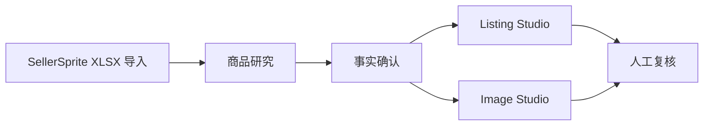

# 工作流说明

轻选工作台把跨境商品研究与内容创作组织为一条受控流程。机器处理数据整理与 AI 草稿，人在关键节点确认。

## 完整流程

## 1. SellerSprite 商品数据导入

在「发现商品」页上传 SellerSprite 导出的 XLSX 文件。

- 服务端解析报表，提取商品资料、市场信号（价格、评分、销量等）与卖点
- 商品资料被投影为「可确认的商品事实候选」
- 市场信号与商品事实在创作输入中隔离，不会混入

## 2. AI 商品研究

对选中的商品执行一键分析，生成四层研究结果：

- **来源**：供应商与价格信号
- **风险**：合规、侵权、供应链等风险标记
- **总结**：目标用户与卖点
- **Listing**：标题与要点草稿建议

研究结果仅是辅助判断，关键动作由人工决定。

## 3. 商品事实确认

进入 Listing Studio 或 Image Studio 时，先确认哪些研究事实可用于创作：

- 每个事实候选需人工勾选
- 同一字段存在多个来源候选时，只能选择其一
- 未确认的信息不会进入权威创作输入

## 4. Listing Studio

基于已确认事实生成 Listing 草稿：

- 中文/混合语言事实自动渲染为自然英文（受控翻译，保留事实溯源；无法安全英文化时拒绝生成而非丢事实）
- AI 生成标题与要点
- 质量校验器校验长度、政策边界与 Claim Evidence
- 质量不达标时自动降级为安全草稿（结构化草稿 / 安全事实草稿）

## 5. Image Studio

基于共享商品事实与已批准的视觉参考生成图片草稿：

- 研究主图可通过「使用此图作为商品参考图」安全导入
- 导入的图片经安全校验（域名白名单、公网 IP、格式与大小限制）
- 用户批准后作为视觉参考进入图片生成
- 支持 Mock 模式，无需真实付费 API

## 人工确认原则

- AI 不会自动采购、上架或投放广告
- 所有 Listing 与图片均为草稿，最终需人工复核
- 研究决定、事实确认、参考图批准均由用户执行
