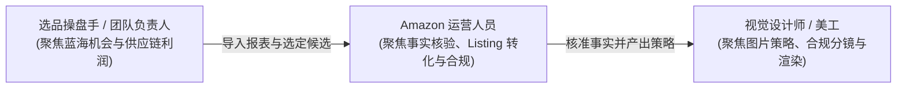
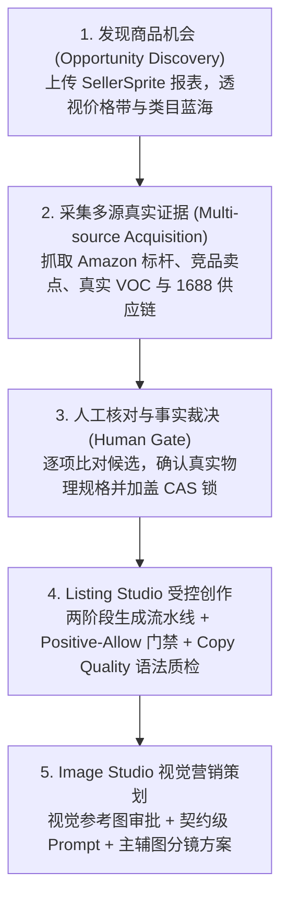

# 产品全景与业务场景 (Product Overview & Business Scenarios)

轻选工作台是一套专为跨境电商卖家、选品操盘手与资深运营打造的 **证据驱动型 AI 商品研究与 Listing 优化工作台**。它颠覆了传统“凭空捏造 Prompt”的套壳 AI 模式，将选品调研、事实核对、文案创作与视觉策划沉淀为标准化、可审计的工业化作业流水线。

---

## 1. 产品定位与核心价值

### 1.1 行业痛点
在传统的跨境电商（如 Amazon、Walmart 等平台）日常运营中，卖家面临三大核心矛盾：
1. **研究耗时且割裂**：需要在选品软件（SellerSprite）、Amazon 详情页、买家评论区与 1688 供应链之间反复横跳，人肉复制粘贴，耗费数小时；
2. **AI 幻觉导致合规灾难**：通用大模型缺乏事实锚点，经常在生成 Listing 时虚构材质等级（如将 201 不锈钢写成 304）、擅自承诺权威认证（如 FDA / BPA Free）或抄袭竞品专利卖点，导致下架、侵权封店或买家差评退货；
3. **文案机器味浓、转化力低**：通用模型输出的英语文案充斥着僵硬病句（如 `opens through its mechanism`、`suitable for use at daily hydration`），无法打动欧美本土消费者，达不到成熟操盘手标准。

### 1.2 轻选工作台的核心解法
- **证据优先（Evidence First）**：以真实采集的外部数据作为决策地基；
- **人机协同（Human-in-the-loop）**：AI 整理证据候选，人做事实最终裁决；
- **双重门禁（Positive-Allow + Copy Quality）**：代码级把关事实边界与语法地道性。

---

## 2. 核心用户角色与协作流 (User Personas)

- **选品操盘手**：关注市场体量、竞争热度、价格分布带与 1688 采购成本，评估项目可行性；
- **Amazon 运营人员**：核对商品物理规格、提炼买家 VOC 痛点反转点、生成高转化且合规的英文 Listing；
- **视觉美工人员**：直接获取基于确认事实生成的标准图片分镜与视觉参考提示词，大幅缩短拍摄与渲染沟通成本。

---

## 3. 五大核心业务旅程 (Core User Journeys)

### 3.1 第一步：商机发现与候选入池 (Opportunity Discovery)
- 运营上传 SellerSprite（卖家精灵）市场分析报表（XLSX 格式）或输入行业热词；
- 系统自动解析商品总览、销量走势、垄断程度、价格段分布与评分分布；
- 优质潜力商品一键加入候选商品池（`OpportunityCandidate`），统一跟踪研究状态。

### 3.2 第二步：多源客观证据链构建 (Evidence Acquisition)
- 进入单品研究控制台后，系统一键调度四大采集通道：
  - **Amazon 详情标杆**：获取美区（ZIP 90001 / USD 货币）真实详情，绑定 ASIN 与变体；
  - **标杆竞品五点**：分析 Top 竞品的卖点宣称与差异化站位；
  - **真实买家评论 (VOC)**：提取高频差评痛点与好评惊喜点；
  - **1688 供应链货源**：获取国内源头供应商报价、起订量（MOQ）与材质线索。
- 所有数据进入证据库归档，打上 SHA-256 来源指纹，杜绝篡改。

### 3.3 第三步：人工事实裁决门禁 (Human Gate)
- 系统遵循 **“证据不等于事实（Evidence ≠ Fact）”** 哲学；
- AI 仅将采集到的碎片整理为事实候选（如：材质、容量、隔层数、净重、配件清单）；
- 运营人员在界面中逐项核实并打勾确认，确认的事实打上不可篡改的 CAS 版本印章成为 `Confirmed Facts`；未勾选项坚决不进入下游生成上下文。

### 3.4 第四步：Listing Studio 高转化受控创作 (Listing Studio)
- **阶段 A 事实语义渲染**：将已确认事实精确映射为规范结构化语义，严格保障数字与单位精准对应；
- **阶段 B 运营自然润色**：融入核心关键词流量靶向，由大语言模型转化为符合北美消费者语感的自然表达；
- **代码级质检门禁**：
  - **Positive-Allow 检查**：文案中出现的任何事实宣称逐字回溯，严禁虚构认证或等级；
  - **Copy Quality 语法引擎**：正则级拦截 5 大类机器僵硬病句（机制套壳、搭配错误、场景口吃等）；
- 一键复制格式完美的标题（Title）、五点卖点（Bullet Points）、长描述（Description）与后台搜索词（Search Terms）。

### 3.5 第五步：Image Studio 视觉策划工坊 (Image Studio)
- 运营批准商品研究阶段的主图作为视觉参考图；
- 系统根据确认事实与目标买家场景，生成符合 Amazon 图片政策的视觉营销策略；
- 输出主图（白底实拍）、功能拆解图、场景代入图、尺寸对比图的分镜脚本与精准生图提示词，供摄影师与 3D 渲染师直接作业。

---

## 4. 商业回报与运营提升

| 运营指标 | 传统纯人工作业 | 通用套壳 AI 工具 | 轻选工作台 |
| :--- | :--- | :--- | :--- |
| **单品调研耗时** | 3 ~ 4 小时 | 10 分钟（但无法验证事实） | **15 分钟（深度证据全覆盖）** |
| **事实幻觉率** | 0% | 25% ~ 40%（易产生虚构属性） | **0%（Positive-Allow 强力保障）** |
| **文案语法地道性** | 依赖外教或资深文案 | 机器味浓重，充斥病句 | **原生级欧美语感，正则级语病拦截** |
| **供应链结合度** | 依靠人工表格对齐 | 完全脱节 | **打通 1688 真实起订量与梯度采购价** |
| **团队协同防冲突** | 容易发生文件覆盖 | 无法协同 | **全流程 CAS 乐观并发锁** |
